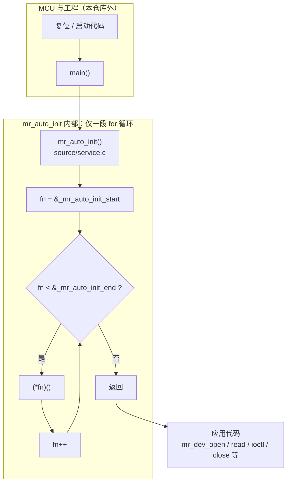
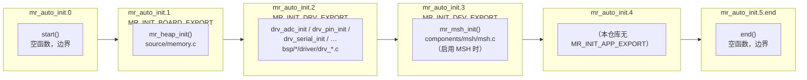
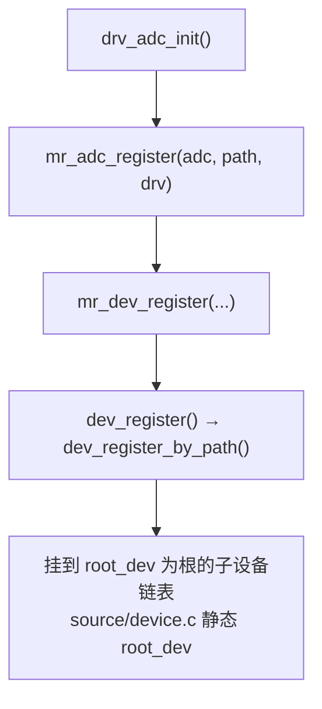
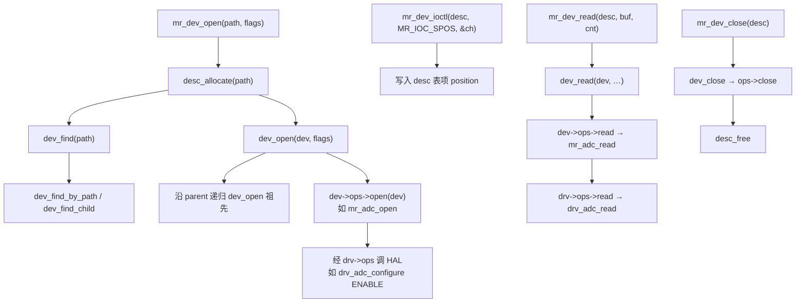

# MR 设备框架：运行流程与学习导读

  

本文档说明**程序实际执行路径**（与当前仓库源码一致）、**建议的阅读顺序**（按认知习惯：先骨架、再注册、再打开读写），并对所列函数做**自然语言**说明。

  

---

  

## 1. 与代码一致的运行流程（Mermaid）

  

### 1.1 总览：从 `main` 到业务逻辑

  

本库**不提供**芯片复位入口；`Reset_Handler → main` 由 BSP/启动文件完成。库内可见的“应用入口之后”路径以示例工程为准：`main` 首先调用 `mr_auto_init()`，再使用 `mr_dev_*` 访问设备。

  

```mermaid

flowchart TD

    subgraph BSP["MCU 与工程（本仓库外）"]

        RST["复位 / 启动代码"]

        MAIN["main()"]

        RST --> MAIN

    end

  

    MAIN --> A1["mr_auto_init()<br/>source/service.c"]

  

    subgraph AUTO["mr_auto_init 内部：仅一段 for 循环"]

        A1 --> L1["fn = &_mr_auto_init_start"]

        L1 --> L2{"fn < &_mr_auto_init_end ?"}

        L2 -->|是| L3["(*fn)()"]

        L3 --> L4["fn++"]

        L4 --> L2

        L2 -->|否| A2["返回"]

    end

  

    A2 --> APP["应用代码<br/>mr_dev_open / read / ioctl / close 等"]

```

  

### 1.2 `(*fn)()` 实际会跑到哪些函数（链接脚本 + 导出宏）

  

初始化函数**不是**运行时扫描出来的，而是编译期放进段 `mr_auto_init.*`、由链接脚本 `KEEP(*(SORT(mr_auto_init.*)))` 排成连续表（见 `tool.py` 写入的 ld 片段）。`service.c` 里用 **`start`（段 `mr_auto_init.0`）** 和 **`end`（段 `mr_auto_init.5.end`）** 作为表边界符号 `_mr_auto_init_start` / `_mr_auto_init_end`，循环会**逐个调用**表内每一个函数指针。

  

下图为**本仓库已出现的导出级别**（同一段内多个 `.c` 的先后顺序由链接命令中目标文件顺序决定，图中不强行写死顺序）：

  

```mermaid

flowchart LR

    subgraph S0["mr_auto_init.0"]

        F0["start()<br/>空函数，边界"]

    end

    subgraph S1["mr_auto_init.1<br/>MR_INIT_BOARD_EXPORT"]

        F1["mr_heap_init()<br/>source/memory.c"]

    end

    subgraph S2["mr_auto_init.2<br/>MR_INIT_DRV_EXPORT"]

        F2["drv_adc_init / drv_pin_init /<br/>drv_serial_init / …<br/>bsp/*/driver/drv_*.c"]

    end

    subgraph S3["mr_auto_init.3<br/>MR_INIT_DEV_EXPORT"]

        F3["mr_msh_init()<br/>components/msh/msh.c<br/>（启用 MSH 时）"]

    end

    subgraph S4["mr_auto_init.4"]

        F4["（本仓库无 MR_INIT_APP_EXPORT）"]

    end

    subgraph S5["mr_auto_init.5.end"]

        F5["end()<br/>空函数，边界"]

    end

    S0 --> S1 --> S2 --> S3 --> S4 --> S5

```

  

**驱动初始化典型链路（以 ADC 为例，与 `bsp/st/driver/drv_adc.c`、`device/adc.c` 一致）：**

  

```mermaid

flowchart TD

    D["drv_adc_init()"] --> R["mr_adc_register(adc, path, drv)"]

    R --> MR["mr_dev_register(...)"]

    MR --> DR["dev_register() → dev_register_by_path()"]

    DR --> TREE["挂到 root_dev 为根的子设备链表<br/>source/device.c 静态 root_dev"]

```

  

### 1.3 初始化完成后：打开设备并读数据（与 `device.c` + 类设备层一致）

  

以 `0-learn/examples/example_adc.c` 的用法为模板：

  

```mermaid

flowchart TD

    O1["mr_dev_open(path, flags)"] --> O2["desc_allocate(path)"]

    O2 --> O2a["dev_find(path)"]

    O2a --> O2b["dev_find_by_path / dev_find_child"]

    O2 --> O3["dev_open(dev, flags)"]

    O3 --> O3a["沿 parent 递归 dev_open 祖先"]

    O3 --> O3b["dev->ops->open(dev)<br/>如 mr_adc_open"]

    O3b --> O3c["经 drv->ops 调 HAL<br/>如 drv_adc_configure ENABLE"]

  

    IO1["mr_dev_ioctl(desc, MR_IOC_SPOS, &ch)"] --> IO2["写入 desc 表项 position"]

    RD1["mr_dev_read(desc, buf, cnt)"] --> RD2["dev_read(dev, …)"]

    RD2 --> RD3["dev->ops->read → mr_adc_read"]

    RD3 --> RD4["drv->ops->read → drv_adc_read"]

  

    CL["mr_dev_close(desc)"] --> CL2["dev_close → ops->close"]

    CL2 --> CL3["desc_free"]

```

  

说明：`mr_dev_ioctl` 对 `MR_IOC_SPOS` 等框架命令在 `mr_dev_ioctl` 内直接处理；**其它**命令进入 `default` 分支，调用 `dev_ioctl`，最终到设备类的 `ops->ioctl`（如 `mr_adc_ioctl`）。

  

---

  

## 2. 建议的阅读顺序（具体文件与函数）

  

按“先搞清**谁调用谁**，再搞清**设备怎么挂上树**，最后搞清**一次 open/read 怎么走**”的顺序读，与大脑建 mental model 的顺序一致。

  

| 顺序 | 位置 | 重点看什么 |

|------|------|------------|

| 1 | `include/mr_def.h` | `MR_INIT_EXPORT`、`MR_INIT_BOARD_EXPORT` / `DRV` / `DEV`、`mr_init_fn_t`：初始化表项长什么样。 |

| 2 | `source/service.c` | `start`、`end`、`mr_auto_init`：表边界与 for 循环的**唯一**实现。 |

| 3 | `tool.py`（约 244–252 行） | `KEEP(*(SORT(mr_auto_init.*)))`：链接时如何把段收成一张表。 |

| 4 | `source/memory.c` | `mr_heap_init`：板级阶段具体做了什么事（堆初始化）。 |

| 5 | 任选一个 BSP 驱动，如 `bsp/st/driver/drv_adc.c` | `drv_adc_init` → `mr_adc_register`：驱动如何把逻辑设备挂进框架。 |

| 6 | `device/adc.c` | `mr_adc_register`、`mr_adc_open` / `mr_adc_read` / `mr_adc_ioctl`：设备类如何把请求转到 `drv->ops`。 |

| 7 | `source/device.c` | 自上而下：`root_dev` → `dev_find` / `dev_register` → `mr_dev_register` → `mr_dev_open` → `desc_allocate`、`dev_open` → `mr_dev_read`/`mr_dev_write`/`mr_dev_ioctl` → `dev_read`/`dev_write`/`dev_ioctl`。 |

| 8 | `include/mr_api.h` | 对外 API 声明，对照 `device.c` 实现建立索引。 |

| 9 | `0-learn/examples/example_adc.c`（或 `example_pin_blink.c`） | `main` 里先 `mr_auto_init()` 再 `mr_dev_*`：与真实运行顺序一致。 |

  

若使用 MSH：在读完 `device.c` 后加读 `components/msh/msh.c` 中的 `mr_msh_init` 及命令如何调到 `mr_dev_*`。

  

---

  

## 3. 各函数在做什么（自然语言说明）

  

### 3.1 自动初始化链

  

- **`start`（`service.c`，`MR_INIT_EXPORT(start, "0")`）**  

  空函数，占位；其函数指针排在初始化表最前，符号名为 `_mr_auto_init_start`，给 `mr_auto_init` 的循环提供起始地址。

  

- **`end`（`service.c`，`MR_INIT_EXPORT(end, "5.end")`）**  

  空函数，占位；符号名为 `_mr_auto_init_end`，循环条件为 `fn < &_mr_auto_init_end`，故**不会**执行 `end` 本身（只执行到表中 `end` 之前的最后一项）。边界语义与 `for` 写法严格对应。

  

- **`mr_auto_init`（`service.c`）**  

  从 `_mr_auto_init_start` 起，按内存中连续排列的函数指针逐个调用，直到 `_mr_auto_init_end` 之前；完成所有通过 `MR_INIT_*_EXPORT` 注册的初始化。

  

- **`mr_heap_init`（`memory.c`，`MR_INIT_BOARD_EXPORT`）**  

  把静态数组 `heap_mem` 接成空闲块链表，供后续 `mr_malloc` / `mr_free` 使用。

  

- **`drv_adc_init`（示例：`bsp/st/driver/drv_adc.c`）**  

  对每个片上 ADC 实例调用 `mr_adc_register`，把框架内的 `mr_adc` 设备注册到设备树路径（如 `"adc1"`），并绑定 BSP 侧的 `mr_drv`（含 `drv->ops` 与硬件私有数据）。

  

- **`mr_msh_init`（`components/msh/msh.c`，`MR_INIT_DEV_EXPORT`，可选）**  

  在启用 MSH 时注册命令表等，使 shell 可通过命令访问设备；具体细节见该文件实现。

  

### 3.2 设备注册与查找（`device.c` 为主）

  

- **`dev_find_child` / `dev_find_by_path` / `dev_find`**  

  在根设备 `root_dev` 下的子链表上按路径分段查找，支持多级路径，返回 `struct mr_dev *` 或 `NULL`。

  

- **`dev_register_child` / `dev_register_by_path` / `dev_register`**  

  在关中断（`mr_interrupt_disable`/`enable`）保护下，把新设备挂到父节点的子链表；路径可为多级，递归找到父节点再挂叶子名。

  

- **`mr_dev_register`（对外）**  

  校验参数并清零/初始化 `mr_dev` 各字段（类型、flags、`ops`、`drv`、引用计数等），再调用 `dev_register` 完成挂载。

  

- **`mr_adc_register`（`device/adc.c`）**  

  填好 ADC 类静态 `mr_dev_ops`，再调用 `mr_dev_register`，类型为 `MR_DEV_TYPE_ADC`，并传入 BSP 的 `struct mr_drv *`。

  

### 3.3 描述符与 open/read/ioctl/close（`device.c`）

  

- **`desc_allocate` / `desc_free`**  

  在全局 `desc_map` 里分配或释放一个“打开实例”：关联 `struct mr_dev *`、打开标志、当前 position、读写回调链表节点等。

  

- **`mr_dev_open`**  

  若 `flags == MR_O_QUERY` 则只查询设备支持标志；否则分配描述符，再 `dev_open`：沿父设备递归打开，首次打开时调用 `dev->ops->open`（如 `mr_adc_open` → 驱动 `configure` 开硬件）。

  

- **`dev_open` / `dev_close`（static）**  

  维护 `ref_count`：第一次打开时自顶向下 `open`，最后一次关闭时自顶向下 `close`，保证父路径已打开再操作子设备。

  

- **`mr_dev_read` / `mr_dev_write`**  

  校验描述符与读写权限后，调用 `dev_read`/`dev_write`：可选锁、`dev->position`、同步/阻塞标志，最终调到 `dev->ops->read`/`write`。

  

- **`dev_read` / `dev_write` / `dev_ioctl`（static）**  

  在设置 `position`、`sync` 后调用具体 `ops`，必要时配合 `MR_USING_RDWR_CTL` 的锁。

  

- **`mr_dev_ioctl`**  

  处理框架通用命令（如 `MR_IOC_SPOS` 设置描述符上的 position）；其余命令交给 `dev_ioctl` → 设备类 `ops->ioctl`。

  

- **`mr_dev_isr`**  

  设备中断上报路径：可选调用 `ops->isr`，并对读/写完成事件遍历挂在设备上的描述符回调。

  

### 3.4 ADC 类与 BSP 驱动（衔接关系）

  

- **`mr_adc_open` / `mr_adc_close` / `mr_adc_read` / `mr_adc_ioctl`（`device/adc.c`）**  

  `open`/`close` 通过 `drv->ops->configure` 开关 ADC；`read` 按当前 `dev->position` 通道调用 `drv->ops->read`；`ioctl` 处理 ADC 专有命令，通道使能等与 `adc->channels` 位图及驱动 `channel_configure` 配合。

  

- **`drv_adc_configure` / `drv_adc_read` 等（`drv_adc.c`）**  

  使用 HAL 配置寄存器、启动转换、读原始值，是“唯一知道硬件细节”的一层。

  

---

  

## 4. 小结

  

- **运行主线**：应用 `main` → `mr_auto_init()` 内**唯一循环**依次执行链接器排好的初始化函数 → 应用通过 **`mr_dev_open` / `read` / `ioctl` / `close`** 访问设备。  

- **设备从哪来**：各 `drv_*_init` 里调用类注册函数（如 `mr_adc_register`）→ `mr_dev_register` → 挂到 **`root_dev` 树**。  

- **读代码技巧**：先 `mr_def.h` + `service.c` 锁定自动初始化机制，再沿**一条具体外设**（如 ADC）从 `drv_*.c` 跟到 `device/*.c` 再跟到 `device.c` 的公共路径，最后对照 `example_*.c` 的 `main` 跑通心理轨迹。

  

---

  

*文档生成依据：仓库内 `source/service.c`、`source/device.c`、`source/memory.c`、`include/mr_def.h`、`tool.py`、`device/adc.c`、`bsp/st/driver/drv_adc.c`、`0-learn/examples/example_adc.c` 等当前实现。*