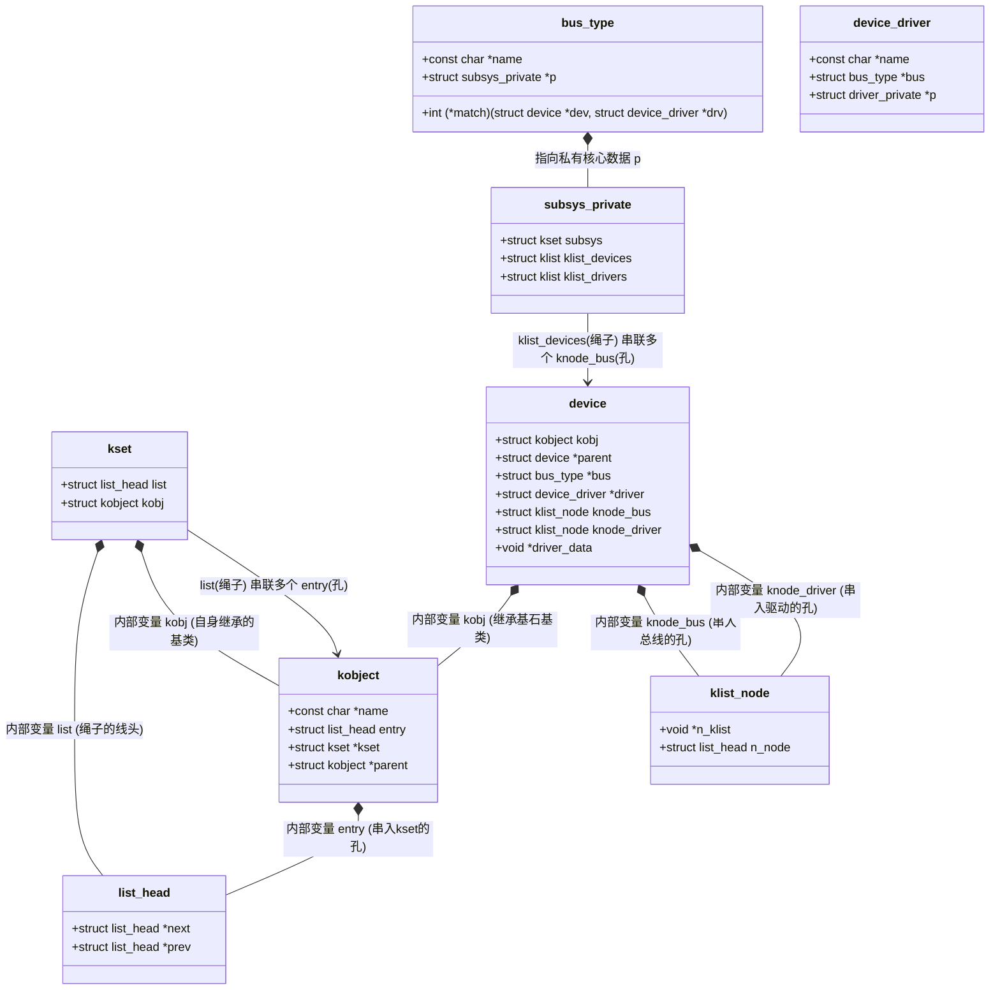

```mermaid
classDiagram
    direction TB

    %% 1. 基础链表节点 (珠子上的孔)
    class list_head {
        +struct list_head *next
        +struct list_head *prev
    }

    class klist_node {
        +void *n_klist
        +struct list_head n_node
    }

    %% 2. 核心基石层 (LDD3 Ch14)
    class kobject {
        +const char *name
        +struct list_head entry
        +struct kset *kset
        +struct kobject *parent
    }

    class kset {
        +struct list_head list
        +struct kobject kobj
    }

    %% 3. LDM 真正的黑盒枢纽
    class subsys_private {
        +struct kset subsys
        +struct klist klist_devices
        +struct klist klist_drivers
    }

    %% 4. LDM 顶层管理视图 (官方文档 Driver Model)
    class bus_type {
        +const char *name
        +struct subsys_private *p
        +int (*match)(struct device *dev, struct device_driver *drv)
    }

    %% 5. LDM 物理实体 (官方文档 The Basic Device Structure)
    class device {
        +struct kobject kobj
        +struct device *parent
        +struct bus_type *bus
        +struct device_driver *driver
        +struct klist_node knode_bus
        +struct klist_node knode_driver
        +void *driver_data
    }

    class device_driver {
        +const char *name
        +struct bus_type *bus
        +struct driver_private *p
    }

    %% ======== 核心组织关系连线 ========

    %% 内存嵌入关系 (表示 B 是 A 的内部成员变量)
    kobject *-- list_head : 内部变量 entry (串入kset的孔)
    kset *-- list_head : 内部变量 list (绳子的线头)
    kset *-- kobject : 内部变量 kobj (自身继承的基类)
    
    device *-- kobject : 内部变量 kobj (继承基石基类)
    device *-- klist_node : 内部变量 knode_bus (串入总线的孔)
    device *-- klist_node : 内部变量 knode_driver (串入驱动的孔)

    bus_type *-- subsys_private : 指向私有核心数据 p

    %% 动态链表串联关系 (绳子穿过孔)
    kset --> kobject : list(绳子) 串联多个 entry(孔)
    subsys_private --> device : klist_devices(绳子) 串联多个 knode_bus(孔)
```