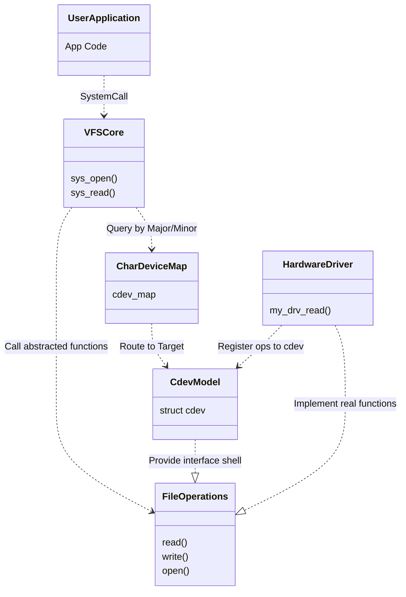

```mermaid
classDiagram
    direction TB

    class UserApplication {
        App Code
    }
    class VFSCore {
        sys_open()
        sys_read()
    }
    class CharDeviceMap {
        cdev_map
    }
    class FileOperations {
        read()
        write()
        open()
    }
    class CdevModel {
        struct cdev
    }
    class HardwareDriver {
        my_drv_read()
    }

    %% 静态依赖连线设计
    UserApplication ..> VFSCore : SystemCall
    
    %% VFS 路由查询
    VFSCore ..> CharDeviceMap : Query by Major/Minor
    CharDeviceMap ..> CdevModel : Route to Target
    
    %% 泛化隔离的核心接口
    VFSCore ..> FileOperations : Call abstracted functions
    
    %% 抽象模型和驱动的接口实现与提供
    CdevModel ..|> FileOperations : Provide interface shell
    HardwareDriver ..> CdevModel : Register ops to cdev
    HardwareDriver ..|> FileOperations : Implement real functions
```