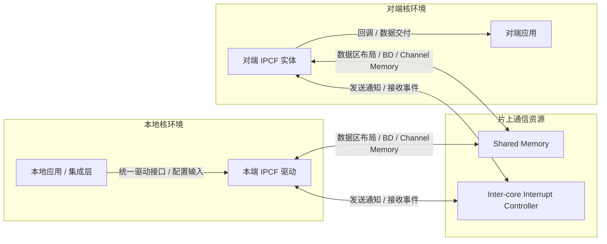
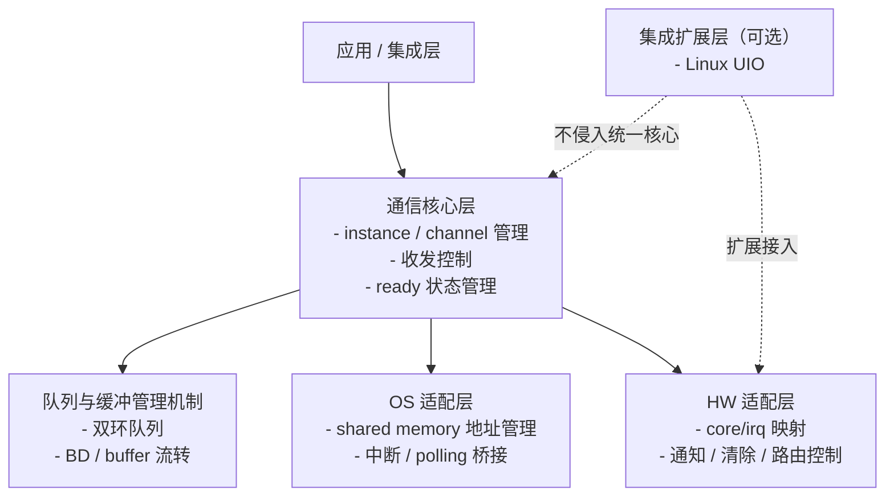
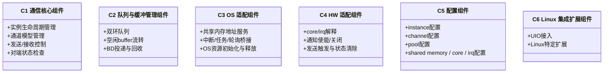
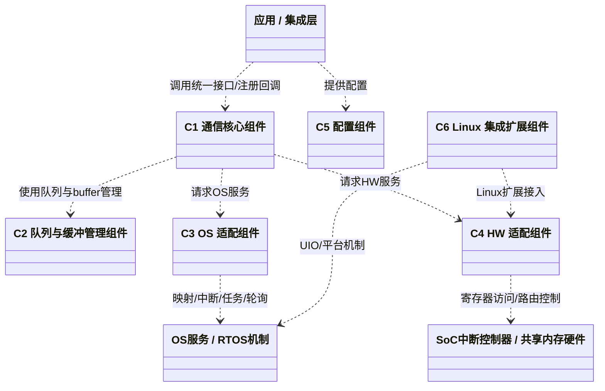
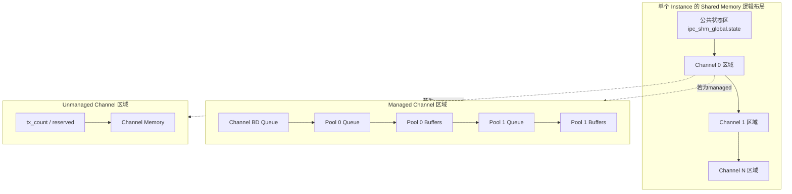
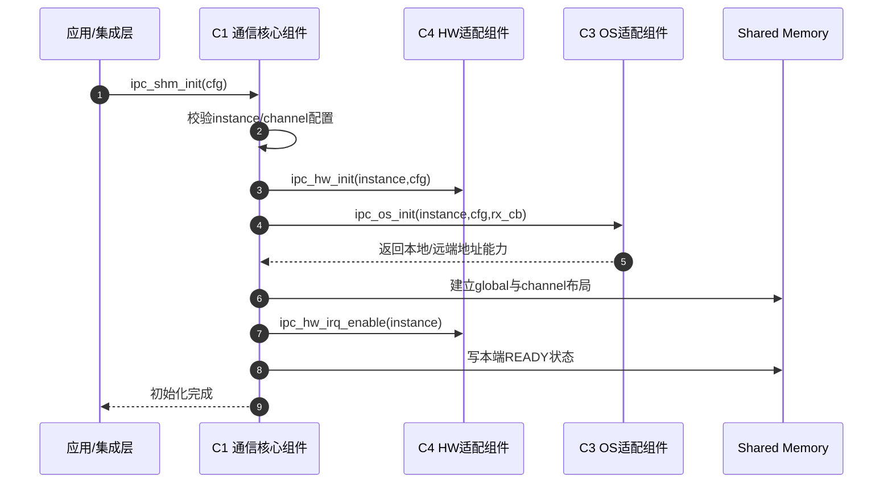
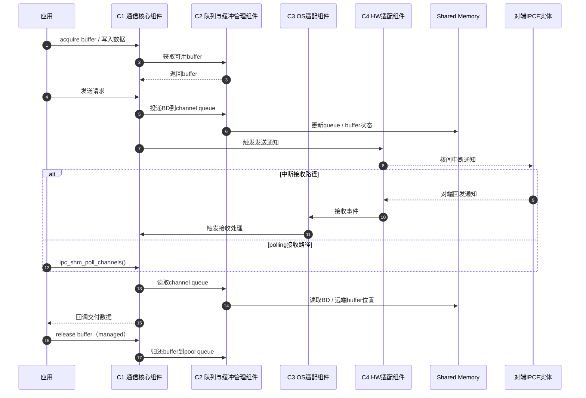

# IPCF 驱动软件架构设计说明

  

## 1. 文档目的

  

本文档用于给出 IPCF 驱动的统一化软件架构设计，作为 Linux 与 RTOS 两套实现的上层架构设计基线，用于支持设计评审、开发对齐、变更分析和 Automotive SPICE 软件架构工作产品补充。

  

本文档遵循以下原则：

  

- 以需求目标和系统约束驱动架构设计，而不是以代码结构直接替代架构设计

- 采用正常的软件架构设计逻辑描述系统分层、组件职责、接口、交互与变体

- 现有代码实现仅作为架构一致性校核依据，不作为架构叙述主线

- 对外给出统一架构，对内保留 Linux/RTOS 变体边界

  

## 2. 适用范围

  

本文档适用于当前 IPCF 驱动工程的统一软件架构设计，覆盖以下两个部署形态：

  

- Linux 平台驱动实现

- RTOS 平台驱动实现

  

本文档关注的软件对象包括：

  

- 共享内存通信核心

- 队列与缓冲区管理机制

- OS 适配层

- HW 适配层

- 配置模型

- Linux 用户态扩展接入路径

  

本文档不覆盖：

  

- 对端应用的软件设计

- SoC 之外的系统级分区设计

- 安全分析、性能测试报告、验证报告

- 非驱动功能的软件业务逻辑

  

## 3. 架构设计输入

  

### 3.1 设计目标

  

IPCF 驱动的架构设计目标如下：

  

- 为同一芯片内部不同处理核心之间提供统一的共享内存通信机制

- 在 Linux 与 RTOS 两种运行环境下提供一致的外部通信能力与配置模型

- 支持多个通信实例与多个通信通道

- 支持由驱动管理缓冲区的通信模式，以及由应用管理通道内存的通信模式

- 隔离协议核心与 OS/HW 依赖，降低平台迁移与维护成本

- 支持中断驱动接收；在适用场景下支持 polling 接收

- 支持后续平台、OS 和集成方式的扩展

  

### 3.2 外部可见需求归纳

  

虽然当前工作区未附带完整需求规格说明，但从接口契约、配置模型和工程目标可以归纳出本架构需要满足的外部可见需求：

  

- 驱动应提供统一的初始化、释放、发送、接收与状态检查接口

- 驱动应支持多个逻辑通信实例

- 每个实例应支持多个通信通道

- 通道应支持 managed 与 unmanaged 两种资源管理模式

- 驱动应支持本地核与对端核之间基于共享内存的数据交换

- 驱动应通过核间中断或 polling 机制通知对端/处理接收

- 驱动配置应由集成层提供，并可描述共享内存、核 ID、中断与 channel 结构

  

### 3.3 约束条件

  

本架构设计受到以下约束：

  

- Linux 与 RTOS 运行环境不同，但底层硬件通信模型一致

- 驱动必须基于共享内存与核间中断控制器工作

- 本地与对端的共享内存布局和 channel 配置必须对称

- 共享内存区域按低层平台约束使用，要求尽量对齐访问

- 资源受限环境下，架构需尽量保持核心逻辑简洁和可复用

  

## 4. 架构设计原则

  

为满足上述目标与约束，软件架构采用以下原则：

  

- 分层设计：协议核心、OS 适配、HW 适配、集成扩展彼此分离

- 核心复用：Linux 与 RTOS 共享同一套核心通信模型

- 配置驱动：实例、通道、缓冲区与中断关系由配置定义

- 接口稳定：上层使用统一驱动接口，不感知底层 OS/HW 差异

- 变体受控：平台差异和 OS 差异仅在明确的变体层内展开

- 一致性可校核：架构设计应能映射到现有实现并支持后续变更审查

  

## 5. 系统上下文

  

IPCF 驱动处于本地应用与底层核间通信资源之间，对上为应用或集成层提供统一通信接口，对下依赖共享内存和核间中断控制器，并与对端核上的对应通信实体配合完成数据交换。

  

```mermaid

flowchart LR

    subgraph LC["本地核环境"]

        APP["本地应用 / 集成层"]

        IPCF_L["本端 IPCF 驱动"]

    end

  

    subgraph HW["片上通信资源"]

        SHM["Shared Memory"]

        IRQ["Inter-core Interrupt Controller"]

    end

  

    subgraph RC["对端核环境"]

        IPCF_R["对端 IPCF 实体"]

        RAPP["对端应用"]

    end

  

    APP -->|"统一驱动接口 / 配置输入"| IPCF_L

    IPCF_L <-->|"数据区布局 / BD / Channel Memory"| SHM

    IPCF_L <-->|"发送通知 / 接收事件"| IRQ

    IPCF_R <-->|"数据区布局 / BD / Channel Memory"| SHM

    IPCF_R <-->|"发送通知 / 接收事件"| IRQ

    IPCF_R -->|"回调 / 数据交付"| RAPP

```

  

## 6. 总体架构

  

### 6.1 分层视图

  

IPCF 驱动采用四层主体架构和一个可选扩展层：

  

```mermaid

flowchart TB

    APP["应用 / 集成层"]

    CORE["通信核心层\n- instance / channel 管理\n- 收发控制\n- ready 状态管理"]

    QUEUE["队列与缓冲管理机制\n- 双环队列\n- BD / buffer 流转"]

    OSAL["OS 适配层\n- shared memory 地址管理\n- 中断 / polling 桥接"]

    HWAL["HW 适配层\n- core/irq 映射\n- 通知 / 清除 / 路由控制"]

    EXT["集成扩展层（可选）\n- Linux UIO"]

  

    APP --> CORE

    CORE --> QUEUE

    CORE --> OSAL

    CORE --> HWAL

    EXT -.扩展接入.-> HWAL

    EXT -.不侵入统一核心.-> CORE

```

  

- 应用/集成层

- 通信核心层

- OS 适配层

- HW 适配层

- 集成扩展层（仅特定平台需要）

  

### 6.2 架构分层说明

  

#### 6.2.1 应用/集成层

  

应用/集成层负责：

  

- 提供驱动配置

- 调用驱动公共接口

- 注册接收回调

- 对于 RTOS 变体，完成中断与驱动入口的集成连接

  

#### 6.2.2 通信核心层

  

通信核心层是统一架构的中心，负责：

  

- instance 和 channel 生命周期管理

- managed/unmanaged 两类通道模型管理

- 缓冲区获取、发送、释放

- 接收分发与公平调度

- 对端 ready 状态检查

- 共享内存布局管理

  

该层不直接依赖具体 OS API 或 SoC 寄存器访问方式。

  

#### 6.2.3 OS 适配层

  

OS 适配层负责：

  

- 管理本地与远端共享内存地址的获取/保存/映射

- 管理 OS 相关的中断注册、延后处理或 polling 桥接

- 向通信核心层提供统一 OS 侧服务接口

  

#### 6.2.4 HW 适配层

  

HW 适配层负责：

  

- 将逻辑上的核 ID、IRQ 配置转换为平台寄存器级操作

- 使能/关闭接收中断路由

- 触发发送通知

- 清除接收中断状态

  

#### 6.2.5 集成扩展层

  

集成扩展层用于承载不属于统一通信核心、但属于特定部署环境所需的扩展接入能力。例如 Linux 用户态访问路径可通过 UIO 扩展实现。

  

## 7. 软件组件设计

  

```mermaid

classDiagram

    class C1["C1 通信核心组件"] {

        +实例生命周期管理

        +通道模型管理

        +发送/接收控制

        +对端状态检查

    }

    class C2["C2 队列与缓冲管理组件"] {

        +双环队列

        +空闲buffer流转

        +BD投递与回收

    }

    class C3["C3 OS 适配组件"] {

        +共享内存地址服务

        +中断/任务/轮询桥接

        +OS资源初始化与释放

    }

    class C4["C4 HW 适配组件"] {

        +core/irq解释

        +通知使能/关闭

        +发送触发与状态清除

    }

    class C5["C5 配置组件"] {

        +instance配置

        +channel配置

        +pool配置

        +shared memory / core / irq配置

    }

    class C6["C6 Linux 集成扩展组件"] {

        +UIO接入

        +Linux特定扩展

    }

```

  

### 7.1 组件清单

  

| 组件 ID | 组件名称 | 主要职责 |

| --- | --- | --- |

| C1 | 通信核心组件 | 提供 IPCF 驱动统一功能入口，负责实例管理、通道管理、共享内存布局、数据收发与接收分发 |

| C2 | 队列与缓冲管理组件 | 提供基于共享内存的双环队列机制，支撑 BD 与 buffer 流转 |

| C3 | OS 适配组件 | 提供与操作系统相关的中断处理、共享内存地址管理与 polling 桥接 |

| C4 | HW 适配组件 | 提供与具体硬件平台相关的核间中断路由与通知能力 |

| C5 | 配置组件 | 描述实例、通道、pool、共享内存区域、中断和核 ID 等配置数据 |

| C6 | Linux 集成扩展组件 | 提供 Linux UIO 接入能力，作为 Linux 特定部署扩展 |

  

### 7.2 组件职责定义

  

#### 7.2.1 C1 通信核心组件

  

C1 是本架构的核心控制组件，其职责如下：

  

- 管理多个通信实例

- 管理每个实例下的多个通道

- 根据通道类型选择 managed 或 unmanaged 处理策略

- 管理 shared memory 中的通道布局

- 负责发送路径与接收路径的统一处理

- 调度接收预算，避免单个通道长期独占处理机会

- 对接应用侧回调

- 屏蔽 OS/HW 差异，向上提供统一接口

  

#### 7.2.2 C2 队列与缓冲管理组件

  

C2 为 managed channel 提供通用的缓冲与描述符流转机制，其职责如下：

  

- 提供共享内存双环队列

- 支持空闲 buffer 的获取与归还

- 支持已发送数据的 BD 投递

- 保证队列机制可在 Linux 与 RTOS 之间复用

  

#### 7.2.3 C3 OS 适配组件

  

C3 负责把不同 OS 的执行与中断模型适配为统一驱动服务，其职责如下：

  

- 提供本地/远端 shared memory 地址服务

- 把中断事件转换为核心接收处理触发

- 在支持 polling 的场景下提供轮询桥接

- 负责 OS 相关资源的初始化与释放

  

#### 7.2.4 C4 HW 适配组件

  

C4 负责底层中断控制器与核间通知相关职责：

  

- 解释核 ID 与 IRQ 配置

- 执行接收中断使能与关闭

- 执行发送通知触发

- 执行接收中断状态清除

- 为不同平台提供统一的硬件服务抽象

  

#### 7.2.5 C5 配置组件

  

C5 是架构中的静态设计输入，其职责如下：

  

- 描述 instance 数量与属性

- 描述 channel 数量、类型与参数

- 描述 pool 配置

- 描述共享内存区域

- 描述本地核、对端核和中断配置

- 描述回调入口

  

#### 7.2.6 C6 Linux 集成扩展组件

  

C6 不属于统一核心必需组成，而是 Linux 部署形态下的扩展集成组件。其职责如下：

  

- 为用户态接入提供扩展路径

- 对接 Linux UIO 框架

- 在不影响统一核心设计的前提下提供额外集成能力

  

## 8. 组件关系设计

  

### 8.1 依赖关系

  

组件依赖关系如下：

  

```mermaid

classDiagram

    class APP["应用 / 集成层"]

    class C1["C1 通信核心组件"]

    class C2["C2 队列与缓冲管理组件"]

    class C3["C3 OS 适配组件"]

    class C4["C4 HW 适配组件"]

    class C5["C5 配置组件"]

    class C6["C6 Linux 集成扩展组件"]

    class OS["OS服务 / RTOS机制"]

    class HW["SoC中断控制器 / 共享内存硬件"]

  

    APP ..> C5 : 提供配置

    APP ..> C1 : 调用统一接口/注册回调

    C1 ..> C2 : 使用队列与buffer管理

    C1 ..> C3 : 请求OS服务

    C1 ..> C4 : 请求HW服务

    C3 ..> OS : 映射/中断/任务/轮询

    C4 ..> HW : 寄存器访问/路由控制

    C6 ..> C4 : Linux扩展接入

    C6 ..> OS : UIO/平台机制

```

  

- 应用/集成层依赖 C1 和 C5

- C1 依赖 C2、C3、C4 和应用回调

- C2 不依赖 C3、C4

- C3 为 C1 提供 OS 相关服务

- C4 为 C1 提供 HW 相关服务

- C6 作为 Linux 扩展路径依赖 C4 和 Linux 平台机制

  

### 8.2 关系约束

  

架构中约束以下关系：

  

- C1 不直接包含 OS 或平台相关实现细节

- C2 只承担共享内存队列职责，不感知业务语义

- C3 与 C4 仅作为适配层，不承载协议核心逻辑

- C6 不应反向侵入统一核心设计

  

## 9. 接口架构设计

  

### 9.1 对应用/集成层提供的公共接口

  

IPCF 驱动对上提供统一公共接口，用于满足初始化、发送、接收和状态管理需求：

  

- 初始化接口

- 释放接口

- managed buffer 获取接口

- managed buffer 释放接口

- managed 数据发送接口

- unmanaged memory 获取接口

- unmanaged 数据通知接口

- 对端 ready 状态检查接口

- polling 接收处理入口

  

接口设计原则如下：

  

- 上层接口统一，不因 Linux/RTOS 变体改变使用方式

- 与资源管理相关的能力在 managed/unmanaged 两种模式下分离

- polling 能力作为补充入口，不替代中断驱动主路径

  

### 9.2 回调接口

  

驱动允许应用注册接收回调。

  

回调设计要求如下：

  

- managed channel 回调应接收数据 buffer 和长度

- unmanaged channel 回调应接收通道内存入口

- 回调由驱动在接收路径中触发

- 回调上下文由 OS 变体决定，但架构要求应用按异步接收处理方式设计

  

### 9.3 OS 适配接口

  

通信核心层与 OS 适配层之间应定义统一服务接口，至少覆盖：

  

- OS 初始化

- OS 资源释放

- 本地/远端 shared memory 地址获取

- polling 桥接入口

  

对于 Linux 变体，可根据需要补充中断控制器映射相关服务。

  

### 9.4 HW 适配接口

  

通信核心层与 HW 适配层之间应定义统一服务接口，至少覆盖：

  

- 硬件初始化

- 硬件释放

- 接收通知使能

- 接收通知关闭

- 发送通知触发

- 接收状态清除

  

对于特定平台，可根据需要增加平台内部辅助接口，但不应污染统一对上接口。

  

## 10. 数据架构设计

  

### 10.1 配置数据模型

  

配置数据模型按层次组织：

  

- 驱动级配置

  - instance 级配置

    - shared memory 配置

    - 中断配置

    - core 配置

    - channel 配置

      - channel 类型

      - managed/unmanaged 参数

      - 回调参数

  

该设计满足以下目的：

  

- 用统一模型覆盖 Linux 与 RTOS

- 支持多实例

- 支持多通道

- 支持不同通道资源管理方式

  

### 10.2 共享内存布局设计

  

每个 instance 的共享内存应采用一致、可对称推导的布局方式，原则如下：

  

```mermaid

flowchart TB

    subgraph INST["单个 Instance 的 Shared Memory 逻辑布局"]

        G["公共状态区\nipc_shm_global.state"]

        CH0["Channel 0 区域"]

        CH1["Channel 1 区域"]

        CHN["Channel N 区域"]

    end

  

    subgraph MNG["Managed Channel 区域"]

        CQ["Channel BD Queue"]

        PQ0["Pool 0 Queue"]

        PB0["Pool 0 Buffers"]

        PQ1["Pool 1 Queue"]

        PB1["Pool 1 Buffers"]

    end

  

    subgraph UMG["Unmanaged Channel 区域"]

        TXC["tx_count / reserved"]

        MEM["Channel Memory"]

    end

  

    G --> CH0 --> CH1 --> CHN

    CH0 -.若为managed.-> MNG

    CH0 -.若为unmanaged.-> UMG

    CQ --> PQ0 --> PB0

    PB0 --> PQ1 --> PB1

    TXC --> MEM

```

  

- instance 起始区域保留公共状态信息

- 后续区域按 channel 顺序排布

- managed channel 区域包含 channel queue、pool queue 与实际 buffers

- unmanaged channel 区域包含控制字段与 channel memory

  

该设计满足：

  

- 布局可由配置推导

- 本地和对端可按相同规则解释内存

- 便于初始化、收发与状态同步

  

### 10.3 状态模型

  

驱动需要维护的核心状态包括：

  

- instance 初始化状态

- 对端 ready 状态

- managed channel 中的 buffer/descriptor 流转状态

- unmanaged channel 中的数据更新计数状态

  

## 11. 动态架构设计

  

```mermaid

sequenceDiagram

    autonumber

    participant APP as 应用/集成层

    participant C1 as C1 通信核心组件

    participant C4 as C4 HW适配组件

    participant C3 as C3 OS适配组件

    participant SHM as Shared Memory

  

    APP->>C1: ipc_shm_init(cfg)

    C1->>C1: 校验instance/channel配置

    C1->>C4: ipc_hw_init(instance,cfg)

    C1->>C3: ipc_os_init(instance,cfg,rx_cb)

    C3-->>C1: 返回本地/远端地址能力

    C1->>SHM: 建立global与channel布局

    C1->>C4: ipc_hw_irq_enable(instance)

    C1->>SHM: 写本端READY状态

    C1-->>APP: 初始化完成

```

  

```mermaid

sequenceDiagram

    autonumber

    participant APP as 应用

    participant C1 as C1 通信核心组件

    participant C2 as C2 队列与缓冲管理组件

    participant C3 as C3 OS适配组件

    participant C4 as C4 HW适配组件

    participant SHM as Shared Memory

    participant RMT as 对端IPCF实体

  

    APP->>C1: acquire buffer / 写入数据

    C1->>C2: 获取可用buffer

    C2-->>C1: 返回buffer

    APP->>C1: 发送请求

    C1->>C2: 投递BD到channel queue

    C2->>SHM: 更新queue / buffer状态

    C1->>C4: 触发发送通知

    C4-->>RMT: 核间中断通知

  

    alt 中断接收路径

        RMT-->>C4: 对端回发通知

        C4->>C3: 接收事件

        C3->>C1: 触发接收处理

    else polling接收路径

        APP->>C1: ipc_shm_poll_channels()

    end

  

    C1->>C2: 读取channel queue

    C2->>SHM: 读取BD / 远端buffer位置

    C1-->>APP: 回调交付数据

    APP->>C1: release buffer（managed）

    C1->>C2: 归还buffer到pool queue

```

  

### 11.1 初始化场景

  

初始化场景的设计意图如下：

  

- 先完成配置校验

- 再完成硬件和 OS 侧资源准备

- 再完成共享内存布局与 channel 初始化

- 最后使能接收通知并声明本端 ready

  

该顺序的目的在于避免在内部资源未准备完成前接收到对端通知。

  

### 11.2 managed channel 发送场景

  

managed channel 的发送交互设计如下：

  

1. 发送方申请符合大小要求的 buffer

2. 发送方写入数据

3. 驱动生成数据描述符并投递到发送队列

4. 驱动触发对端通知

  

该设计的目的是：

  

- 把 buffer 生命周期交由驱动管理

- 用统一 BD 机制承载数据传输描述

  

### 11.3 managed channel 接收场景

  

managed channel 的接收交互设计如下：

  

1. 接收由中断或 polling 驱动触发

2. 驱动从接收队列读取数据描述符

3. 驱动计算目标数据地址并回调应用

4. 应用处理后归还 buffer

  

该设计保证：

  

- 数据与 buffer 生命周期解耦

- 同一 channel 上资源流转可闭环

  

### 11.4 unmanaged channel 收发场景

  

unmanaged channel 的交互设计如下：

  

- 发送方直接操作 channel memory

- 发送完成后通过更新计数并通知对端表示新数据可用

- 接收方通过比较对端更新计数判断是否存在新数据

  

该设计适用于：

  

- 应用希望直接控制通道内存

- 不需要由驱动管理 buffer pool 的场景

  

### 11.5 接收调度策略

  

接收处理应采用预算控制和多通道公平处理策略，目的是：

  

- 避免单一 channel 长时间占用处理资源

- 保持接收路径的可控性与可预测性

- 适配不同 OS 下的中断/任务调度模型

  

## 12. 变体架构设计

  

### 12.1 统一部分

  

以下内容属于统一架构基线：

  

- 通信核心层

- 队列与缓冲管理机制

- 配置模型

- managed/unmanaged 通道模型

- 共享内存布局原则

  

### 12.2 Linux 变体

  

Linux 变体的设计特点如下：

  

- 驱动以 Linux kernel module 形式部署

- OS 适配层负责 shared memory 映射与中断注册

- 接收路径采用硬中断 + 延后处理模型

- 可按部署需要增加用户态扩展接入路径

  

### 12.3 RTOS 变体

  

RTOS 变体的设计特点如下：

  

- 驱动以可集成的软件模块形式部署

- OS 适配层根据 RTOS 类型选择具体中断/任务集成方式

- 接收路径可采用中断驱动，也可在适用场景下采用 polling

- 系统集成层需负责中断入口与驱动处理函数的连接

  

### 12.4 变体控制原则

  

架构上规定：

  

- 不得因 Linux/RTOS 差异破坏统一公共接口

- 平台差异应限制在 HW 适配层内

- OS 差异应限制在 OS 适配层内

- 部署扩展能力不得反向侵入通信核心层

  

## 13. 架构约束

  

为保证架构成立，系统集成与后续实现应满足以下约束：

  

- 本地与对端配置必须保持对称

- channel 数量、pool 数量和 instance 数量必须处于设计允许范围内

- managed pool 应按 buffer 大小升序组织

- 共享内存访问应满足平台对齐要求

- 同一 channel 内的资源访问应遵循驱动约定的并发限制

- polling 仅用于适用场景，不应与正常中断路径混用失控

  

## 14. 架构设计决策

  

### 14.1 采用共享内存 + 核间中断作为通信基础

  

决策原因：

  

- 满足同芯片多核之间低开销通信需求

- 能够在 Linux 与 RTOS 之间建立统一通信模型

  

### 14.2 采用统一核心 + 适配层分离的架构

  

决策原因：

  

- 保持跨平台行为一致性

- 降低重复实现成本

- 便于后续平台扩展与问题定位

  

### 14.3 同时支持 managed 与 unmanaged 两类通道

  

决策原因：

  

- 满足不同业务对资源控制粒度的需求

- 兼顾驱动托管模式与应用直控模式

  

### 14.4 采用双环无锁队列机制

  

决策原因：

  

- 适合共享内存场景

- 便于在不同 OS 环境下复用

- 有利于降低同步开销

  

## 15. 实现一致性校核说明

  

本章不作为架构叙述主线，而是用于说明：本文档所定义的统一架构已参考当前实现进行了反向校核，以保证补充文档不会与现有工程冲突。

  

### 15.1 一致性校核结论

  

已完成的校核结论如下：

  

- Linux 与 RTOS 的通信核心实现可归并为一套统一核心

- Linux 与 RTOS 的队列机制实现可归并为一套统一机制

- OS 差异主要体现在中断注册、延后处理和 polling 桥接方式上

- HW 差异主要体现在 SoC 中断控制器访问与 core/irq 映射方式上

- Linux 的 UIO 路径应视为部署扩展，而非统一核心的一部分

  

### 15.2 与实现相关的边界说明

  

为避免架构文档脱离现有工程，需明确以下边界：

  

- Linux 当前实现不将 polling 接收作为有效主路径

- RTOS 变体中，中断入口需由系统集成层连接

- 当前工作区中仅对已有源码实现的 OS/HW 变体进行架构映射

- 对仅在接口中预留、但当前工作区未见对应实现的能力，不在本文档中写成已实现架构能力

  

## 16. 架构到实现的追溯说明

  

为支持文档补齐后的落地审查，架构组件与实现可建立如下追溯关系：

  

| 架构组件 | 实现映射 |

| --- | --- |

| C1 通信核心组件 | `ipcf_linux/ipc-shm.c`、`ipcf_linux/ipc-shm.h`、`ipcf_rtos/common/ipc-shm.c`、`ipcf_rtos/common/ipc-shm.h` |

| C2 队列与缓冲管理组件 | `ipcf_linux/ipc-queue.c`、`ipcf_linux/ipc-queue.h`、`ipcf_rtos/common/ipc-queue.c`、`ipcf_rtos/common/ipc-queue.h` |

| C3 OS 适配组件 | `ipcf_linux/os/ipc-os.c`、`ipcf_linux/os/ipc-os.h`、`ipcf_rtos/os/ipc-os.h`、`ipcf_rtos/os/freertos/ipc-os-freertos.c`、`ipcf_rtos/os/autosar/ipc-os-autosar.c`、`ipcf_rtos/os/baremetal/ipc-os-baremetal.c` |

| C4 HW 适配组件 | `ipcf_linux/hw/ipc-hw.h`、`ipcf_linux/hw/ipc-hw-s32gen1.c`、`ipcf_linux/hw/ipc-hw-s32g3xx.c`、`ipcf_linux/hw/ipc-hw-s32v234.c`、`ipcf_rtos/hw/ipc-hw.h`、`ipcf_rtos/hw/s32gen1/ipc-hw-s32gen1.c`、`ipcf_rtos/hw/s32g3xx/ipc-hw-s32g3xx.c` |

| C5 配置组件 | `ipcf_linux/ipc-shm.h`、`ipcf_rtos/common/ipc-shm.h`、`ipcf_linux/sample_multi_instance/ipcf_Ip_Cfg.h`、`ipcf_linux/sample_multi_instance/ipcf_Ip_Cfg_s32g3.c` |

| C6 Linux 集成扩展组件 | `ipcf_linux/os/ipc-uio.c`、`ipcf_linux/os/ipc-uio.h` |

  

## 17. 结论

  

本文档从需求目标、设计原则、组件划分、接口设计、数据架构、动态交互和变体控制的角度，给出了 IPCF 驱动的统一软件架构设计。

  

该架构设计的核心结论如下：

  

- IPCF 驱动应采用统一通信核心 + OS/HW 适配层的分层架构

- Linux 与 RTOS 两套实现共享统一的通信模型和配置模型

- 平台和 OS 差异应被限制在适配层内

- 扩展集成路径应与统一核心隔离

- 文档主线以架构设计表达为主，实现代码仅用于后置一致性校核与追溯

  

因此，本文档可作为当前 IPCF 驱动工程的正式软件架构设计说明，用于补充架构文档并支撑后续评审与维护。