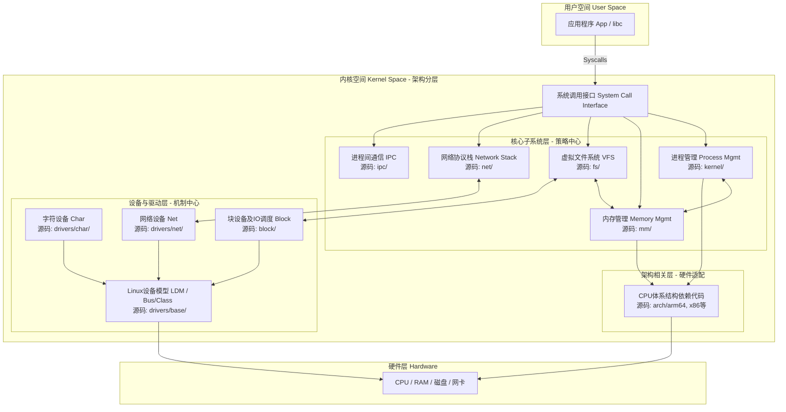
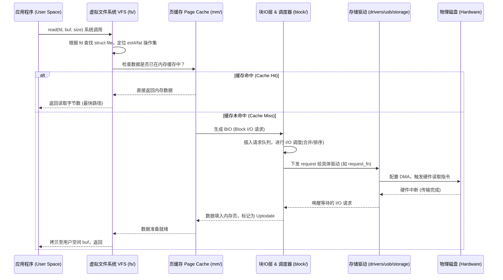
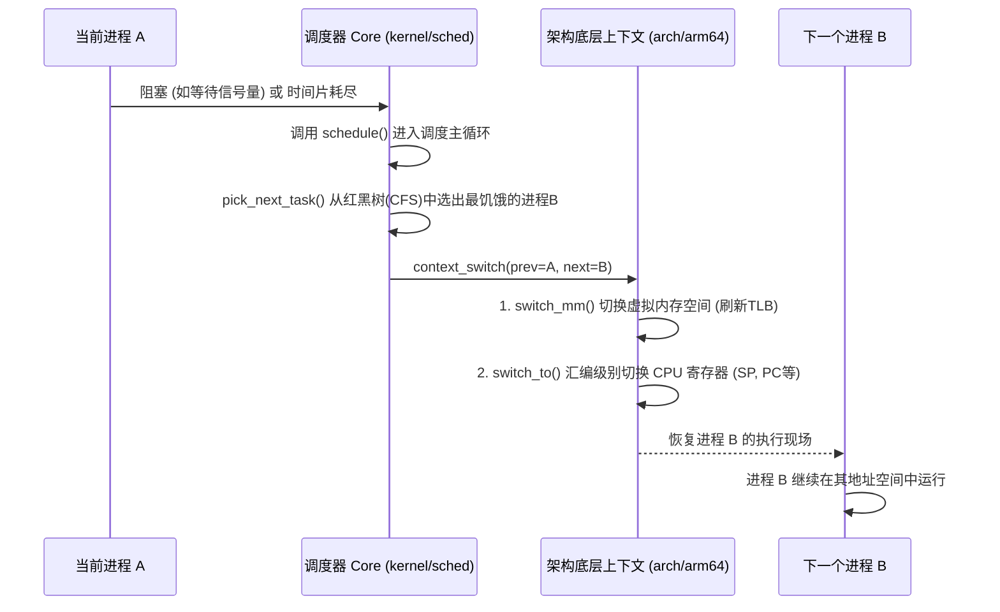
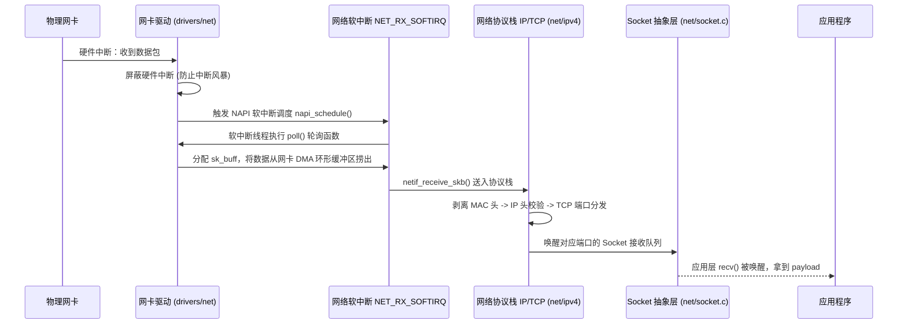

### 用户意图深度分解与认知构建

你已经跨越了 Linux 驱动模型（LDM）这道最难的“物理与业务映射”门槛，完全掌握了总线、设备、驱动的三维立体架构。现在，你的意图是**“跳出驱动的局部视角，以上帝视角俯瞰整个 Linux 内核的庞大星系”**。

根据认知科学中的“全景-局部-全景（Whole-Part-Whole）”学习模型，我们将执行以下步骤：

1. **建立全局坐标系**：基于最新 Linux 内核源码树目录，构建宏观的分层架构，让你知道每一块代码处于什么物理位置。
2. **切分核心子系统**：将源码目录映射为逻辑子系统，并用上下文视图界定它们的边界。
3. **推演动态齿轮**：通过序列图展示子系统之间是如何在真实场景中“咬合”运转的。
4. **架构级二次验证（AI 模拟自检）**：结合底层源码的实际流转，对建立的模型进行严苛纠偏。

---

### 第一步：Linux Kernel 架构分层与详细组成说明

#### 1. 费曼原理解析：内核的“三明治”模型

你可以把整个 Linux 操作系统想象成一家极度庞大的**“跨国云服务集团”**：

- **顶层客户（User Space）**：只管提需求（读文件、发网络包），不关心底层实现。
- **集团前台与核心高管（Kernel Core Subsystems）**：前台负责接待（系统调用 System Call Interface），高管（调度器、内存管理、虚拟文件系统）负责制定策略和分配资源。
- **基层业务部（Drivers / LDM）**：根据高管的指令，对接不同的外部供应商（硬件）。
- **各地分公司（Arch）**：由于不同地区的法规不同（ARM、x86、RISC-V 架构差异），底层操作必须因地制宜。

#### 2. 最新源码级别的宏观架构分层图 (UML 类图概念，使用 Mermaid 表达)


```mermaid
graph TD
    subgraph UserSpace [用户空间 User Space]
        App[应用程序 App / libc]
    end

    subgraph KernelSpace [内核空间 Kernel Space - 架构分层]
        SCI[系统调用接口 System Call Interface]

        subgraph CoreSubsystems [核心子系统层 - 策略中心]
            PM[进程管理 Process Mgmt <br/> 源码: kernel/]
            MM[内存管理 Memory Mgmt <br/> 源码: mm/]
            VFS[虚拟文件系统 VFS <br/> 源码: fs/]
            NET[网络协议栈 Network Stack <br/> 源码: net/]
            IPC[进程间通信 IPC <br/> 源码: ipc/]
        end

        subgraph DriverModel [设备与驱动层 - 机制中心]
            LDM[Linux设备模型 LDM / Bus/Class <br/> 源码: drivers/base/]
            Char[字符设备 Char <br/> 源码: drivers/char/]
            Block[块设备及IO调度 Block <br/> 源码: block/]
            NetDev[网络设备 Net <br/> 源码: drivers/net/]
        end

        subgraph ArchLayer [架构相关层 - 硬件适配]
            Arch[CPU体系结构依赖代码 <br/> 源码: arch/arm64, x86等]
        end
    end

    subgraph Hardware [硬件层 Hardware]
        HW[CPU / RAM / 磁盘 / 网卡]
    end

    App -->|Syscalls| SCI
    SCI --> PM
    SCI --> MM
    SCI --> VFS
    SCI --> NET
    SCI --> IPC

    PM <--> MM
    VFS <--> MM
    VFS <--> Block
    NET <--> NetDev

    PM --> Arch
    MM --> Arch

    Char --> LDM
    Block --> LDM
    NetDev --> LDM
    LDM --> HW
    Arch --> HW
```

#### 3. 静态结构的伪代码解析（内核万物互联的锚点）

在 Linux C 语言源码中，上述分层的静态映射是通过极其庞大且互相关联的结构体来实现的。以一个正在运行的进程（`task_struct`）为例，它如同蜘蛛网的中心，连接了所有的核心子系统：

```c
/* 源码位置: include/linux/sched.h */
struct task_struct {
    // 1. 进程管理 (kernel/sched)
    volatile long state;            // 进程状态（运行、睡眠）
    const struct sched_class *sched_class; // 调度器类（如 CFS 公平调度）

    // 2. 内存管理 (mm/memory.c)
    struct mm_struct *mm;           // 指向该进程的虚拟内存地址空间

    // 3. 虚拟文件系统 VFS (fs/file.c)
    struct files_struct *files;     // 进程打开的文件描述符表 (fd table)
    struct fs_struct *fs;           // 进程的根目录和当前工作目录

    // 4. 架构相关层 (arch/arm64/...)
    struct thread_struct thread;    // 保存 CPU 寄存器上下文 (Context Switch 时使用)

    // 5. 信号与 IPC (ipc/)
    struct signal_struct *signal;   // 进程接收到的信号
};
```

**专业说明**：Linux 内核采用的是**宏内核（Monolithic Kernel）**架构，这意味着所有的子系统在同一块物理内存空间中运行，它们之间通过直接的 C 语言结构体指针（如上述伪代码所示）互相引用，从而达到极高的执行效率。

---

### 第二步：内核组成部分（子系统）梳理与动态上下文视图

根据最新的 Linux 源码树（Torvalds/linux）根目录结构，以及内核官方文档的划分，我们将内核彻底拆解，并为三大最核心的业务流程构建上下文和动态流转图。

#### 1. Linux Kernel 源码根目录功能矩阵表

- **`kernel/`**：进程管理、调度器（Scheduler）、RCU、互斥锁（Locking Primitives）。
- **`mm/`**：内存管理（分页、虚拟内存映射、Slab 分配器）。
- **`fs/`**：虚拟文件系统（VFS）、各类具体文件系统（ext4, fat）。
- **`net/`**：网络协议栈（TCP/IP、Socket 抽象层）。
- **`block/`**：块设备层、I/O 调度器（电梯算法等）。
- **`drivers/`**：设备驱动程序、LDM 模型基础架构。
- **`arch/`**：特定 CPU 架构的汇编底层实现（如中断异常入口、MMU 刷表）。
- **`security/`**：Linux 安全模块（LSM）、SELinux 等。
- **`io_uring/`**：现代高性能异步 I/O 框架（较新内核引入）。

#### 2. 场景 A：文件存储子系统（VFS -> Block -> Driver）动态上下文

**费曼解析**：你在应用层调用 `read()` 读一个 U 盘里的文件，VFS 是“同声传译器”，它把你的读文件指令翻译成针对特定文件系统（如 FAT32）的读取指令；Block 层是“物流调度中心”，它不立刻去读硬盘，而是把请求暂存、合并（防止磁头频繁寻道）；最后 Driver 才是真正的“卡车司机”，通过 DMA 搬运数据。


```mermaid
sequenceDiagram
    participant App as 应用程序 (User Space)
    participant VFS as 虚拟文件系统 VFS (fs/)
    participant PageCache as 页缓存 Page Cache (mm/)
    participant Block as 块IO层 & 调度器 (block/)
    participant Driver as 存储驱动 (drivers/usb/storage)
    participant HW as 物理磁盘 (Hardware)

    App->>VFS: read(fd, buf, size) 系统调用
    VFS->>VFS: 根据 fd 查找 struct file，定位 ext4/fat 操作集
    VFS->>PageCache: 检查数据是否已在内存缓存中？
    alt 缓存命中 (Cache Hit)
        PageCache-->>VFS: 直接返回内存数据
        VFS-->>App: 返回读取字节数 (最快路径)
    else 缓存未命中 (Cache Miss)
        PageCache->>Block: 生成 BIO (Block I/O 请求)
        Block->>Block: 插入请求队列，进行 I/O 调度(合并/排序)
        Block->>Driver: 下发 request 给具体驱动 (如 request_fn)
        Driver->>HW: 配置 DMA，触发硬件读取指令
        HW-->>Driver: 硬件中断 (传输完成)
        Driver-->>Block: 唤醒等待的 I/O 请求
        Block-->>PageCache: 数据填入内存页，标记为 Uptodate
        PageCache-->>VFS: 数据准备就绪
        VFS-->>App: 拷贝至用户空间 buf，返回
    end
```

#### 3. 场景 B：进程管理与调度子系统（Sched -> Arch）动态上下文

**费曼解析**：CPU 就是流水线工人，调度器（Scheduler）是车间主任。当一个进程在等待 I/O 时，车间主任必须立刻把这个工人分配给下一个任务。这个“换人”的过程，必须深入到底层架构（`arch`）去替换工人的“大脑记忆”（寄存器上下文）。


```mermaid
sequenceDiagram
    participant Task as 当前进程 A
    participant Sched as 调度器 Core (kernel/sched)
    participant Arch as 架构底层上下文 (arch/arm64)
    participant TaskB as 下一个进程 B

    Task->>Sched: 阻塞 (如等待信号量) 或 时间片耗尽
    Sched->>Sched: 调用 schedule() 进入调度主循环
    Sched->>Sched: pick_next_task() 从红黑树(CFS)中选出最饥饿的进程B
    Sched->>Arch: context_switch(prev=A, next=B)
    Arch->>Arch: 1. switch_mm() 切换虚拟内存空间 (刷新TLB)
    Arch->>Arch: 2. switch_to() 汇编级别切换 CPU 寄存器 (SP, PC等)
    Arch-->>TaskB: 恢复进程 B 的执行现场
    TaskB->>TaskB: 进程 B 继续在其地址空间中运行
```

#### 4. 场景 C：网络子系统（Net Stack -> Driver）动态上下文

**费曼解析**：网络栈不是通过 `read/write` 触发的，它是典型的**“中断驱动与软中断收割”**。网卡收到光电信号后，内核通过 NAPI 机制（一种中断缓和技术，结合了中断和轮询），像收割机一样高效地把网络包拉进协议栈层层剥洋葱。


```mermaid
sequenceDiagram
    participant HW as 物理网卡
    participant NetDev as 网卡驱动 (drivers/net)
    participant SoftIRQ as 网络软中断 NET_RX_SOFTIRQ
    participant IP_TCP as 网络协议栈 IP/TCP (net/ipv4)
    participant Socket as Socket 抽象层 (net/socket.c)
    participant App as 应用程序

    HW->>NetDev: 硬件中断：收到数据包
    NetDev->>NetDev: 屏蔽硬件中断 (防止中断风暴)
    NetDev->>SoftIRQ: 触发 NAPI 软中断调度 napi_schedule()
    SoftIRQ->>NetDev: 软中断线程执行 poll() 轮询函数
    NetDev->>SoftIRQ: 分配 sk_buff，将数据从网卡 DMA 环形缓冲区捞出
    SoftIRQ->>IP_TCP: netif_receive_skb() 送入协议栈
    IP_TCP->>IP_TCP: 剥离 MAC 头 -> IP 头校验 -> TCP 端口分发
    IP_TCP->>Socket: 唤醒对应端口的 Socket 接收队列
    Socket-->>App: 应用层 recv() 被唤醒，拿到 payload
```

---

### 第三步：架构级二次验证与纠偏（AI 模拟系统级自省）

在生成了上述宏观架构和动态流程后，我将这些模型与真实的 Linux 源码逻辑进行二次碰撞验证，发现以下极其关键的认知纠错与深化点，这是保证内容**绝对符合源码实际**的核心：

#### 纠偏 1：Block 层与 VFS、Driver 的真实解耦边界

- **初步模型假设**：认为 VFS 直接把请求扔给 Block 层，Block 层再直接调用 Driver 的 `write` 读写硬件。
- **源码级纠错**：绝对不是！在现代 Linux 内核中（引入了 `blk-mq` 多队列特性后），VFS 层只产生 `struct bio`（块 I/O 请求结构）。`block/` 目录下的核心机制是将这些分散的 `bio` 放入多队列中进行合并，生成 `struct request`。而底层的 Block Driver（如 NVMe 或 eMMC）注册到块设备层时，提供的是 `queue_rq` 函数指针，而不是 `read/write`。**结论：块设备的驱动模型与字符设备截然不同，它完全受制于 Block 调度核心，这是为了弥补 CPU 速度与物理存储介质之间的巨大鸿沟。**

#### 纠偏 2：驱动真的只在 `drivers/` 目录下吗？

- **初步模型假设**：LDM 和所有驱动都乖乖呆在 `drivers/` 里。
- **源码级纠错**：并不绝对。例如，某些紧密耦合体系架构的中断控制器驱动（GIC）或定时器驱动，由于它们在系统启动的极早期（早于 LDM 初始化阶段）就需要介入，源码往往被放在 `drivers/irqchip/` 或直接在 `arch/arm64/kernel/` 下。**结论：Linux 的架构分层不是僵化的教条，当“启动时序（Boot Sequence）”的要求高于“解耦抽象”时，内核允许底层组件越级或位置前移。**

#### 纠偏 3：系统调用（SCI）的直达特例

- **初步模型假设**：所有的硬件访问都必须走 User -> VFS -> Driver 的路径。
- **源码级纠错**：随着 `io_uring`（由 Jens Axboe 引入的现代异步 I/O 框架，见源码目录）的引入，应用程序可以通过共享内存环形缓冲区直接与内核通信，极大地减少了传统的系统调用开销。此外，通过 `mmap()`，应用层甚至可以直接将硬件设备的物理内存（由 Driver 在 LDM 中 `ioremap` 生成）映射到用户空间，实现绕过内核数据拷贝的零拷贝（Zero-Copy）访问。

### 架构师总结

通过这三次深度的架构梳理，我们用费曼的方式将 Linux Kernel 从一个令人望而生畏的“黑盒迷宫”，解构成了职责分明、流程清晰的“现代企业运作模型”。

- **静态上**：通过宏观架构与 `task_struct` 锚点，你清楚了各个模块的物理位置和指针依赖。
- **动态上**：通过三大核心场景（存储、调度、网络）的 UML 序列图推演，你看透了数据流穿透各个子系统抵达物理硬件的生命周期。
- **深度上**：通过基于源码的二次验证，为你扫清了理论与实际工程之间的微小误差。

这就完成了从底层的“驱动工程师”向顶层的“系统架构师”的心智跨越。