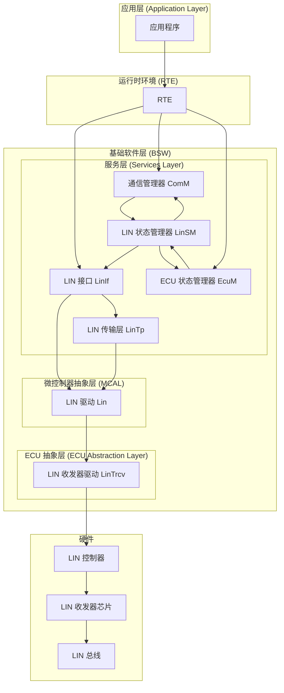

```mermaid
graph TB

    subgraph "应用层 (Application Layer)"

        App[应用程序]

    end

  

    subgraph "运行时环境 (RTE)"

        RTE[RTE]

    end

  

    subgraph "基础软件层 (BSW)"

        subgraph "服务层 (Services Layer)"

            ComM[通信管理器 ComM]

            LinIf[LIN 接口 LinIf]

            LinSM[LIN 状态管理器 LinSM]

            EcuM[ECU 状态管理器 EcuM]

            LinTp[LIN 传输层 LinTp]

        end

  

        subgraph "ECU 抽象层 (ECU Abstraction Layer)"

            LinTrcv[LIN 收发器驱动 LinTrcv]

        end

  

        subgraph "微控制器抽象层 (MCAL)"

            Lin[LIN 驱动 Lin]

        end

    end

  

    subgraph "硬件"

        LinController[LIN 控制器]

        LinTransceiver[LIN 收发器芯片]

        Bus[LIN 总线]

    end

  

    App --> RTE

    RTE --> LinIf

    RTE --> ComM

    RTE --> EcuM

    LinIf --> Lin

    LinIf --> LinTp

    LinTp --> Lin

    LinSM --> LinIf

    LinSM --> ComM

    LinSM --> EcuM

    ComM --> LinSM

    EcuM --> LinSM

    Lin --> LinTrcv

    LinTrcv --> LinController

    LinController --> LinTransceiver

    LinTransceiver --> Bus
```