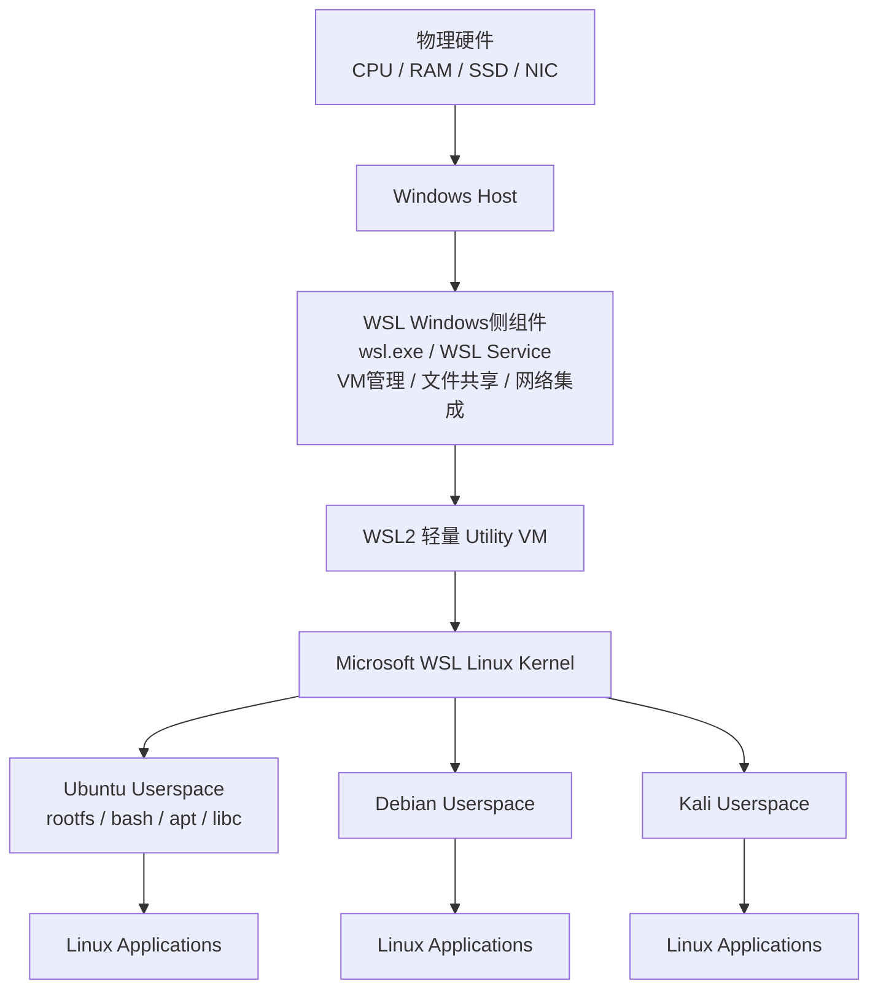
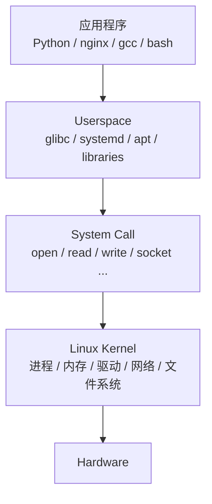
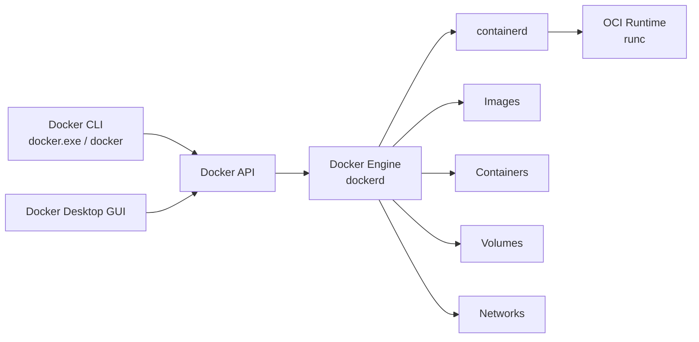
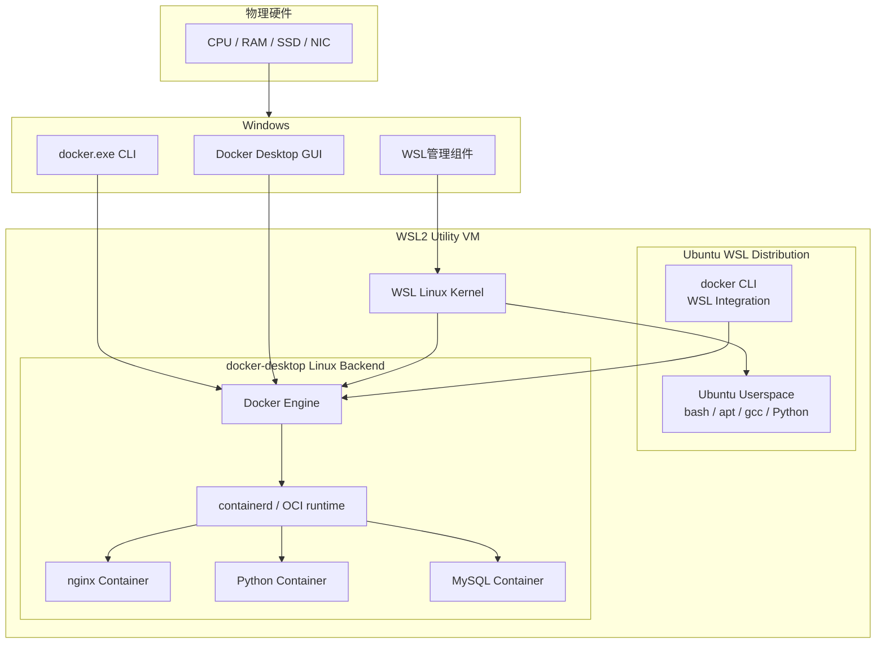
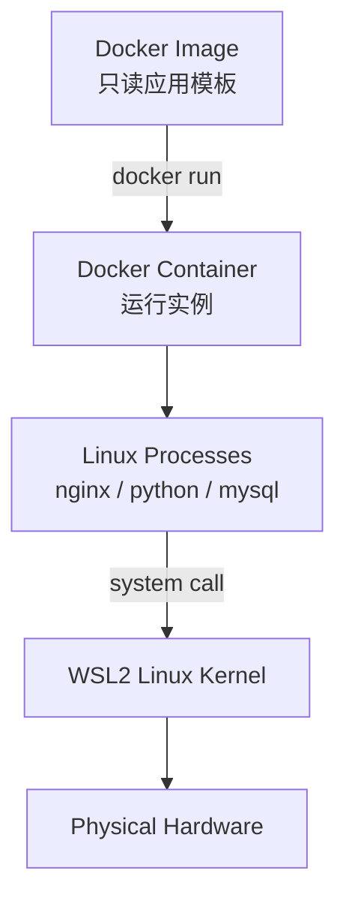
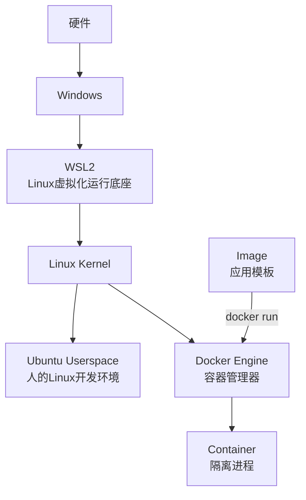

---
tags:
  - tool_chains
---

# WSL2 与 Docker：对象分层、Kernel / Userspace 与部署架构

> [!abstract] 核心结论
> 
> - **WSL2**：Windows 管理的轻量 Linux 虚拟化运行环境，核心包含 **真正的 Linux Kernel**。
>     
> - **WSL 发行版**：主要提供各发行版自己的 **Userspace / rootfs**，共享 WSL2 Kernel。
>     
> - **Docker Desktop**：Windows 侧提供 GUI、CLI 和管理能力；Linux Container 的实际运行底座位于 WSL2 Linux 环境。
>     
> - **Container**：本质是共享 Linux Kernel、但在进程/文件系统/网络等方面被隔离的一组进程。
>     

> [!abstract] 个人补充
>	1.  WSL2部署和Docker Desktop独立部署。
>	2. WSL2部署后包含VM layer、kernel、release version
>	3. Docker Desktop部署会在WSL2中加入backend，包含了docker enginer，可以支持加入containers
>	4. WSLg这货接管了所有渲染工作，也就是托管了WSL中的图形用户界面的渲染；WSLg = Linux GUI 协议（Wayland/X11）和 Windows Desktop 之间的桥。
		你的 Linux Qt 程序仍然使用 Linux Qt + Linux 图形协议；WSLg 负责把它的窗口“远程组合/集成”到 Windows 桌面，并把 Windows 的键鼠输入再送回 Linux。
		_**核心认知：1. 多个dis如ubuntu，共享同一个kernel，如下两图所示；2. docker的backend，本质是为kernel添加了一个用户空间进程——docker engine
		和 image运行时的container；
		2. qemu作为一个设备模拟层，本质是Linux下的一个或者一组进程，可以通过Linux直接部署；也可以通过docker进行部署；但是在实际运行时候都是同一个kernel下的一个或者一组进程，只是后者在docker engine管理之下。**_
		所以，根据`核心认知`，有如下图.
		
		```
		            Windows
                       │
                    WSL2
                       │
                Linux Kernel
                  /         \
                 /           \
        Ubuntu发行版       docker-desktop
            │                  │
           QEMU           Docker Engine
                               │
                           Container
                               │
                              QEMU
		```

---
![[Pasted image 20260814163534.png]]

![[Pasted image 20260814163104.png]]
---

# 1. WSL2 是什么？

## 1.1 费曼理解

把 Windows 看成一栋本来只支持“Windows 住户”的楼。

WSL2 相当于微软在楼里建立了一块：

> **专门运行 Linux 的独立区域。**

这个区域不是假装 Linux，也不是把 Linux 命令翻译成 Windows 命令，而是真的放进去一个：

```
Linux Kernel
```

然后 Ubuntu、Debian 等发行版把自己的：

```
bash
apt
glibc
systemd
/etc
/usr
各种软件
```

放进去使用。

因此：

```
Windows
   │
   ▼
WSL2 Linux运行底座
   │
   ├── Ubuntu Userspace
   ├── Debian Userspace
   └── Kali Userspace
```

---

## 1.2 客观概念

WSL2 可以抽象为：

```
WSL2
=
Windows侧管理组件
+
轻量虚拟化机制
+
Linux Kernel
+
Windows/Linux集成机制
```

它**不是 WSL1 那种 Linux syscall 翻译层**。

WSL2 内部运行的是真正的 Linux Kernel。

---

# 2. WSL2 在 Windows 中的分层结构

## 2.1 费曼理解

可以把整个 PC 看成：

```
硬件
 ↓
Windows
 ↓
Linux虚拟运行底座
 ↓
Linux发行版的软件环境
 ↓
Linux应用程序
```

也就是：

> Windows 管 WSL2，WSL2 管 Linux Kernel，发行版提供 Linux 用户空间，最终应用运行在用户空间。

---

## 2.2 客观架构



核心层级：

```
Level 0：Hardware
             ↓
Level 1：Windows
             ↓
Level 2：WSL2 虚拟化运行环境
             ↓
Level 3：Linux Kernel
             ↓
Level 4：Distribution Userspace
             ↓
Level 5：Linux Application
```

---

# 3. 为什么 WSL2 已经有 Linux，还要安装 Ubuntu？

## 3.1 费曼理解

Linux 系统可以先粗暴拆成两半：

```
Linux系统
=
Kernel
+
Userspace
```

Kernel 像发动机。

Userspace 像方向盘、仪表盘、座椅、空调等真正供用户使用的东西。

WSL2 已经给你准备好了发动机：

```
WSL Linux Kernel
```

但你还需要选择：

```
Ubuntu 内饰
Debian 内饰
Kali 内饰
```

因此：

```
WSL Kernel
    +
Ubuntu Userspace
    =
WSL中的Ubuntu环境
```

---

## 3.2 客观概念

典型 Linux 系统：

```
┌─────────────────────┐
│     Userspace       │
│ bash / libc / apt   │
│ systemd / Python    │
├─────────────────────┤
│    Linux Kernel     │
├─────────────────────┤
│      Hardware       │
└─────────────────────┘
```

在普通 Ubuntu PC 上通常是：

```
Ubuntu Kernel
+
Ubuntu Userspace
```

而在 WSL2 中变成：

```
WSL Kernel
+
Ubuntu Userspace
```

---

# 4. “发行版不是应该包括 Kernel 吗？”

## 4.1 费曼理解

**是，但 Kernel 和 Userspace 本来就是可以拆开的。**

例如嵌入式 Linux：

```
U-Boot
 ↓
厂商 Linux Kernel
 ↓
Ubuntu rootfs
```

完全可以工作。

也可以：

```
同一个 Kernel
     │
     ├── Ubuntu rootfs
     └── Debian rootfs
```

WSL2 使用的正是同一个思想。

---

## 4.2 客观概念

“Ubuntu 发行版”作为完整的软件发行体系，通常确实包括：

```
Ubuntu
│
├── Linux Kernel
├── libc
├── systemd
├── bash
├── apt
├── coreutils
├── 软件仓库
└── 默认配置
```

但是：

```
Kernel
```

只是发行版中的一个组件，并不是和 Userspace 不可拆分。

因此 WSL2 可以：

```
完整 Ubuntu
│
├── Ubuntu Kernel        → 不作为WSL运行Kernel
│
└── Ubuntu Userspace     → 使用

             +

Microsoft WSL Kernel
```

最终：

```
flowchart TB

    K["WSL2 Linux Kernel"]

    U["Ubuntu Userspace"]
    D["Debian Userspace"]
    KA["Kali Userspace"]

    K --> U
    K --> D
    K --> KA
```

所以在 Ubuntu WSL 中：

```
cat /etc/os-release
```

看到：

```
Ubuntu
```

因为这是 **Userspace 的发行版身份**。

而：

```
uname -r
```

会看到类似：

```
*-microsoft-standard-WSL2
```

因为真正执行系统调用的是 **WSL Linux Kernel**。

---

# 5. Kernel 与 Userspace 的边界

Linux 最核心的分层：



因此：

```
Userspace
负责：
程序、库、Shell、包管理、配置

Kernel
负责：
CPU调度
内存管理
进程管理
驱动
网络协议栈
文件系统
系统调用
```

一句话：

> **发行版决定“用户看到什么软件环境”，Kernel 决定“这些程序如何真正使用硬件资源”。**

---

# 6. Docker 是什么？

## 6.1 费曼理解

假设一个 Python 程序需要：

```
Python 3.12
numpy
某版本glibc
配置文件
程序源码
```

直接给别人，容易出现：

> “你机器能跑，我机器不能跑。”

Docker 的思路：

> 把程序和它需要的 Userspace 环境一起封起来。

形成：

```
Image
```

然后运行 Image：

```
Image
  │
  │ run
  ▼
Container
```

因此：

> **Image 是模板，Container 是模板运行起来后的实例。**

---

# 7. Container 的本质

## 7.1 费曼理解

Container 看起来像一台“小 Linux”：

```
/
├── bin
├── usr
├── etc
└── app
```

甚至它还有自己的：

```
IP
进程
文件系统
用户
```

但是它并没有自己的 Linux Kernel。

它其实只是：

> **Linux Kernel 给某些进程划了一圈围墙。**

于是 Container A 看不到 Container B 的很多资源。

---

## 7.2 客观概念

Container 本质：

> **共享宿主 Linux Kernel，但通过 Namespace、cgroup 等机制实现资源隔离的一组进程。**

典型隔离内容：

```
PID Namespace       → 进程隔离
Mount Namespace     → 文件系统隔离
Network Namespace   → 网络隔离
User Namespace      → 用户隔离
cgroups             → CPU/内存等资源限制
```

因此：

```
Container ≠ Virtual Machine
```

VM：

```
Application
Userspace
Guest Kernel
Virtual Hardware
```

Container：

```
Application
Userspace
────────────
共享Host Linux Kernel
```

---

# 8. Docker 软件由什么组成？

## 8.1 费曼理解

Docker 可以理解成：

```
遥控器
+
机器
+
模板仓库
+
运行出来的应用
```

对应：

```
docker CLI       → 遥控器

Docker Engine    → 真正干活的机器

Image            → 程序模板

Container        → 运行起来的实例

Registry         → 网上保存模板的仓库
```

---

## 8.2 客观组件



主要对象：

```
Docker
│
├── Docker CLI
│
├── Docker Engine
│
├── Image
│
├── Container
│
├── Volume
│
├── Network
└── Registry / Docker Hub
```

---

# 9. Docker Desktop 与 Docker Engine 不等价

## 9.1 费曼理解

Docker Desktop 可以理解成：

> Docker 的 Windows 管理套件。

里面既有：

```
Dashboard
Settings
CLI
Backend管理
```

真正创建 Container 的则是：

```
Docker Engine
```

因此：

```
Docker Desktop ≠ Docker Engine
```

而是：

```
Docker Desktop
包含/管理
Docker Engine运行环境
```

---

## 9.2 客观关系

Windows 侧：

```
Docker Desktop GUI
docker.exe
Windows管理组件
```

负责：

```
配置
控制
Dashboard
启动/关闭Backend
WSL Integration
网络/文件共享集成
```

Linux 侧 Backend：

```
Docker Engine
containerd
runc
Linux Containers
```

负责真正执行容器工作负载。

---

# 10. Docker + WSL2 的组合部署架构

## 10.1 费曼理解

把它想成三层：

### 第一层：Windows

负责：

> “我要创建 nginx Container。”

### 第二层：WSL2

负责：

> “我提供真正的 Linux Kernel。”

### 第三层：Docker

负责：

> “我利用 Linux Kernel 的隔离能力，把 nginx 变成 Container。”

所以：

```
Windows控制
     ↓
Docker Engine执行
     ↓
WSL2 Kernel提供Linux能力
     ↓
Container真正运行
```

---

## 10.2 客观完整架构



---

# 11. 最重要的上下文关系

整个体系最终可以浓缩为：

```
Physical Hardware
        │
        ▼
Windows
        │
        ├── Docker Desktop GUI
        ├── docker.exe
        └── WSL管理组件
                │
                ▼
              WSL2
                │
        ┌───────┴────────┐
        │                │
   Linux Kernel     Linux Kernel能力
        │                │
   Ubuntu Userspace      │
                         ▼
                   Docker Engine
                         │
                  ┌──────┼──────┐
                  ▼      ▼      ▼
               nginx   mysql  python
             Container Container Container
```

注意：

> Ubuntu WSL 和 Docker Container 并不是“Ubuntu → Docker → Container”的必然父子关系。

更准确是：

```
                 WSL2 Linux Kernel
                    /          \
                   /            \
                  ▼              ▼
          Ubuntu Userspace   Docker Backend
                                  │
                                  ▼
                              Containers
```

也就是说：

**Ubuntu WSL 和 Docker backend 都依赖 WSL2 Linux 运行底座。**

---

# 12. Docker Container 与 WSL Distribution 的根本区别

|对象|WSL Distribution|Docker Container|
|---|---|---|
|典型用途|Linux开发环境|应用部署环境|
|Kernel|共享WSL Kernel|共享Linux Kernel|
|Userspace|比较完整|通常最小化|
|生命周期|长期使用|可随时创建/销毁|
|管理工具|WSL|Docker Engine|
|Image驱动|否|是|
|主要对象|Linux发行版环境|隔离进程组|

费曼理解：

```
WSL Ubuntu
≈ 给“人”使用的一台Linux开发工作台

Docker Container
≈ 给“一个应用”使用的隔离运行盒子
```

---

# 13. Image → Container → Kernel 的关系



最关键的是：

```
Image
不包含正在运行的Kernel

Container
也不启动自己的Kernel

Container里的程序
直接使用宿主Linux Kernel
```

---

# 14. 最终心智模型

只记下面这一张：



---

# 15. 一句话速记

> **WSL2：解决 Windows 怎么拥有真正的 Linux 运行环境。**

> **发行版：Kernel 与 Userspace 本身可分离；WSL2 使用统一 WSL Kernel + 各发行版 Userspace。**

> **Docker Engine：利用 Linux Kernel 的 namespace/cgroup 等能力管理 Container。**

> **Image：程序运行环境模板。**

> **Container：Image 运行后的隔离进程环境，不拥有独立 Kernel。**

> **Docker Desktop：Windows 上的 Docker 管理套件；Linux Container 的核心执行环境依托 WSL2。**