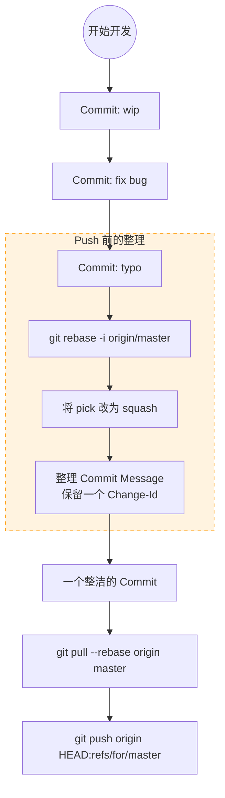

这是一个非常典型且真实的问题！

如果不加处理直接 push，Gerrit 会为你本地那堆 `wip`, `fix typo`, `temp save` 的每一个 commit 都生成一个独立的 Review 单子，并在 Gerrit 上形成一条长长的、令人崩溃的**依赖链（Relation Chain）**。你的 Reviewer 会想打人。

**解决方法的核心在于：在 Push 之前，把本地的“碎” Commits，“捏”成一个（或几个）整洁的 Commit。**

这里有两种主要方法，推荐程度从高到低：

---

### 方法一：交互式变基（Interactive Rebase）—— **最推荐，最专业**

这是 Git 的手术刀，允许你精准地把最近的 N 个提交合并成一个。

#### 1. 操作时机

在执行完 `git pull --rebase origin master` 解决完冲突，**准备 Push 之前**。

#### 2. 命令

假设你本地有 3 个随意的 commit，你想把它们合并成 1 个：

Bash

```
# -i 表示 interactive（交互式）
# HEAD~3 表示处理最近的3个提交，或者直接用 origin/master 也可以
git rebase -i origin/master
```

#### 3. 编辑界面（核心步骤）

执行命令后，会弹出一个文本编辑器（Vim 或 Nano），显示如下内容：

Plaintext

```
pick 1a2b3c4 feat: 完成登录功能雏形 (最早的提交)
pick 5d6e7f8 fix: 修复了一个空指针报错
pick 9g0h1i2 style: 格式化代码
```

**你需要修改前面的动词：**

- 保留第一个为 `pick`（捡选，保留这个 commit 的头部）。
    
- 把后面想合并的 commit 改为 `s` 或 `squash`（挤压，合并到上一个）。
    

**修改后如下：**

Plaintext

```
pick 1a2b3c4 feat: 完成登录功能雏形
s 5d6e7f8 fix: 修复了一个空指针报错  <-- 改成 s
s 9g0h1i2 style: 格式化代码          <-- 改成 s
```

#### 4. 编辑 Commit Message

保存并退出编辑器后，Git 会弹出的第二个窗口，让你合并这三个 commit 的 message。

- **清理**：把那些无用的 "fix bug" 文字删掉。
    
- **重写**：只保留一个清晰的、符合规范的 Commit Message，例如 `feat: 实现用户登录模块`。
    
- **关键点**：**确保最后只保留一行 `Change-Id: Ixxxx...`**。如果之前的 commit 生成了多个 Change-Id，请手动删掉多余的，只留一个。
    

#### 5. 推送

现在你本地只剩下一个完美的 commit 了。

Bash

```
git push origin HEAD:refs/for/master
```

---

### 方法二：软重置（Soft Reset）—— **最简单粗暴**

如果你觉得交互式 rebase 的界面太复杂，容易操作晕，可以用这个“后悔药”方法。它的作用是：**保留代码修改，但抹去 commit 历史**。

#### 1. 操作步骤

假设你本地有一堆乱七八糟的 commit，但代码现在的状态是你想要的。

Bash

```
# 1. 把所有 commit 撤销，但保留文件修改在暂存区（绿色状态）
git reset --soft origin/master

# 2. 此时用 git status 看，所有修改都在，只是变成了未 commit 状态
# 3. 重新提交一个干干净净的 commit
git commit -m "feat: 这是一个包含所有修改的整洁提交"
```

#### 2. 推送

Bash

```
git push origin HEAD:refs/for/master
```

**缺点**：如果你之前的 commit 写了一些很重要的详细描述，用 `reset --soft` 会丢失这些 message（除非你去 reflog 里找），你需要重新写一遍 commit message。

---

### 方法三：预防为主（Amend）

如果你能养成好习惯，其实可以避免产生那么多垃圾 commit。

- **第一次提交**：`git commit -m "feat: start working"`
    
- **后续修改**：当你改了几个错别字，或者修复了一个小 bug，**不要** `git commit` 生成新的。
    
- **使用 Amend**：
    
    Bash
    
    ```
    git add .
    git commit --amend --no-edit  # --no-edit 表示不修改 commit message
    ```
    
    这样你就在不断地“修正”同一个 commit，始终保持本地只有一个节点。
    

---

### 总结流程图 (Mermaid)

这是经过“整理”后的最终推荐流程：

代码段



### 给你的建议

作为刚接触 Gerrit 的程序员，我建议你：

1. **日常开发**：尽量多用 `git commit --amend`，减少垃圾 commit 的产生。
    
2. **提交前**：如果确实产生了多个 commit（比如你想分阶段保存），请务必使用 **方法一（rebase -i）** 进行压缩。
    
3. **检查**：Push 前，永远用 `git log` 看一眼，**确保你和 `origin/master` 之间，只有 1 个（或你预期数量的）Commit**。