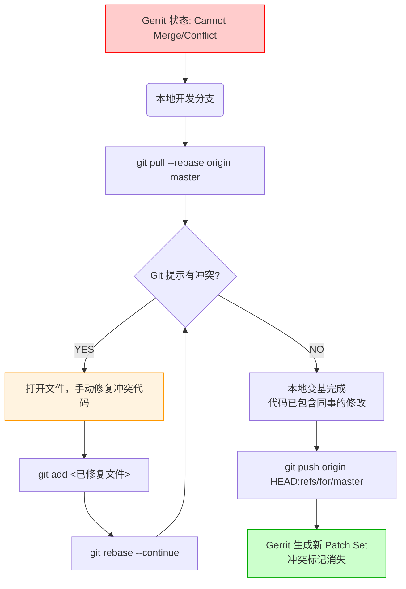

这种情况在 Gerrit 开发中非常常见，通常被称为 **"Merge Conflict"（合并冲突）** 或者 **"Path Conflict"**。

这种情况的表现是：

1. 你在本地开发，或者代码已经推送到 Gerrit 正在评审中。
    
2. 你的同事比你手快，先把他的代码 **Submit（合并）** 到了远程 master 分支。
    
3. Gerrit 发现你的代码和同事刚合并的代码修改了同一个文件的同一块地方。
    
4. Gerrit 界面上你的单子会显示红色的 **"Cannot Merge"** 或 **"Merge Conflict"**，并且 "Submit" 按钮是灰色的。
    

你必须在**本地**解决这个冲突，然后更新 Gerrit 上的单子。以下是标准处理流程：

---

### 核心思路

**不能在 Gerrit 网页上解决内容冲突**。你需要把远程最新的代码（包含同事刚合并的修改）拉到本地，手动把你的代码“叠加”上去，修好冲突，再推上去。

### 详细操作步骤

假设你当前停留在你的开发分支（比如 `feature/login`）上。

#### 第一步：同步远程代码并变基 (Rebase)

这步命令的意思是：_“把远程最新的 master 代码拉下来，然后尝试把我的修改加在它们后面。”_

Bash

```
git pull --rebase origin master
```

**此时 Git 会报错并暂停：**

终端会提示类似 `CONFLICT (content): Merge conflict in src/utils.py`，并告诉你 Rebase 失败，正在等待你处理。

#### 第二步：手动解决冲突 (Manual Fix)

1. **打开冲突文件**：使用你的 IDE（VS Code, IntelliJ 等）或编辑器打开报错的文件。
    
2. **寻找冲突标记**：你会看到类似这样的代码：
    
    Python
    
    ```
    <<<<<<< HEAD
    def connect_db():
        print("Connected to v1 database")  # 这是同事刚合并的代码
    =======
    def connect_db():
        print("Connected to new v2 database") # 这是你的代码
    >>>>>>> feat: upgrade database connection
    ```
    
3. **决定代码逻辑**：你需要决定保留谁的，或者如何融合。比如你保留你的，但需要适配同事的改动。
    
4. **保存文件**：删除 `<<<`, `===`, `>>>` 这些标记，只留下正确的代码，保存。
    

#### 第三步：标记冲突已解决

告诉 Git 这个文件修好了。

Bash

```
git add src/utils.py
# 如果有多个文件冲突，都要 add
```

#### 第四步：继续变基 (Continue)

**注意：这里绝对不要执行 `git commit`！** 因为我们还在 Rebase 的过程中。

Bash

```
git rebase --continue
```

- 如果还有其他 Commit 有冲突，Git 会再次暂停，重复 第二步~第四步。
    
- 如果成功，终端会提示 `Successfully rebased and updated refs/heads/...`。
    

#### 第五步：推送更新到 Gerrit

现在你本地的代码已经是基于最新 master 且没有冲突的了。我们需要更新 Gerrit 上那个挂掉的单子。

Bash

```
# 还是这条万能命令
git push origin HEAD:refs/for/master
```

**结果**：

1. Gerrit 会检测到 `Change-Id` 没变。
    
2. 它会在同一个评审单下生成一个新的 **Patch Set**。
    
3. 界面上的 "Cannot Merge" 红色警告消失，变为绿色。
    
4. 如果之前已经有点好的 `+2`，通常会保留（取决于配置），或者需要 Reviewer 重新看一眼确认冲突解决得对不对。
    

---

### 流程图演示

代码段



---

### 常见疑问 (FAQ)

#### Q1: Gerrit 网页上有个 "Rebase" 按钮，我能点那个吗？

**A:**

- **如果只是顺序问题，没有内容冲突**：也就是你改了文件 A，同事改了文件 B，仅仅是因为时间先后导致你的 Base 落后了。**可以点！** 点击后 Gerrit 会自动在服务器端帮你变基，非常方便。
    
- **如果有内容冲突**（修改了同一行）：**点了也没用**。Gerrit 会提示 Rebase 失败（Conflicts），告诉你必须在本地解决。
    

#### Q2: 我解决了冲突，push 之后变成了两个单子？

**A:** 这通常是因为你在 rebase 过程中或者 commit 时，不小心**弄丢了或修改了** commit message 最后那行 `Change-Id: Ixxxx...`。

- **补救**：在本地找到那个新 commit，用 `git commit --amend` 把原来的 Change-Id 贴回去，再 push。
    

#### Q3: 为什么不建议用 `git merge master` 来解决？

**A:** 如果你用 merge：

1. 本地会生成一个 Merge Commit。
    
2. Gerrit 默认拒绝接收 Merge Commit（Push 报错）。
    
3. 即使配置允许，你的提交历史会变成网状，不符合 Gerrit 倡导的线性历史。**始终使用 Rebase 是 Gerrit 的最佳实践。**