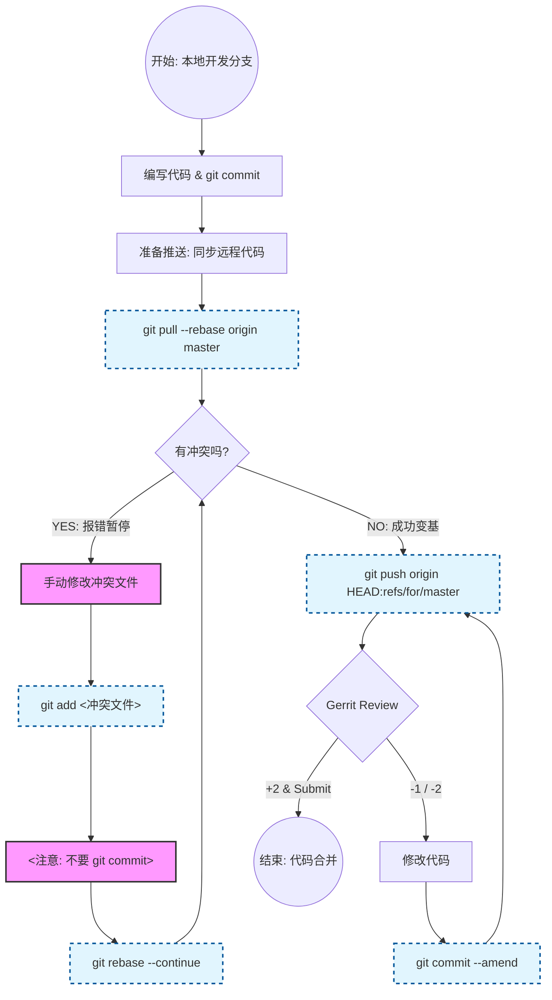

# flow
---
这是一个非常专业且实用的请求。在 Gerrit 工作流中，处理 Rebase 冲突是每个开发者的必修课。

下面是将“标准 Rebase 流”细化后的完整指南，包含了一个详细的 **Mermaid 流程图**，以及针对冲突处理的**详细步骤拆解**。

### 核心逻辑：为什么这么做？

这个流程的目标是：**在把代码推送到服务器之前，先在本地解决掉所有的冲突，并保持提交历史是一条干净的直线。**

---

### 1. 完整流程图 (Mermaid)

这个流程图展示了从“开发”到“解决冲突”再到“推送”的全过程。请特别关注红色的“冲突处理循环”。

代码段



---

### 2. 详细步骤拆解

假设你正在本地分支 `feature/dev` 上工作，远程分支是 `master`。

#### 第一阶段：开发与提交

正常写代码，正常提交。

Bash

```
git add .
git commit -m "feat: 新增数据解析功能"
```

#### 第二阶段：同步远程代码（最关键的一步）

在推送前，必须把远程别人提交的代码“垫”在你的代码下面。

执行命令：

Bash

```
git pull --rebase origin master
```

**此时会有两种结果：**

- **情况 A：顺利（无冲突）**
    
    Git 自动完成变基，你的 Commit 跑到了最新代码的最上面。直接跳到“第三阶段”。
    
- **情况 B：报错（有冲突）**
    
    终端提示：`CONFLICT (content): Merge conflict in src/main.c`，并且 Rebase 过程暂停。**进入下方的“冲突救援”流程。**
    

---

#### 🚨 冲突救援流程 (Conflict Rescue)

当 Rebase 暂停时，请严格按照以下步骤操作：

**1. 找到冲突文件**

终端会告诉你哪些文件冲突了，也可以用 `git status` 查看（显示为 `both modified` 的文件）。

**2. 手动解决冲突**

打开代码编辑器，搜索 `<<<<<<<`。

C

```
<<<<<<< HEAD
int a = 10; // 远程别人的代码
=======
int a = 20; // 你修改的代码
>>>>>>> feat: 新增数据解析功能
```

你需要决定保留哪一行，或者合并逻辑，删除掉 `<<<`, `===`, `>>>` 标记，保存文件。

**3. 标记为已解决**

告诉 Git 这个文件修好了：

Bash

```
git add src/main.c
```

**4. ⚠️ 绝对不要执行 `git commit`**

这是一个新手最容易犯的错！此时你还在 Rebase 的过程中，不需要生成新的 Commit。

**5. 继续 Rebase**

让 Git 继续处理剩下的 Commit：

Bash

```
git rebase --continue
```

**6. 循环检查**

如果你的分支有多个 Commit，或者冲突比较复杂，执行完 `continue` 后，Git 可能会再次暂停（处理下一个 Commit 的冲突）。

- 重复上述 1~5 步，直到终端提示 `Successfully rebased and updated refs/heads/feature/dev`.
    

---

#### 第三阶段：推送到 Gerrit

现在你的本地历史已经是干净且最新的了。

Bash

```
git push origin HEAD:refs/for/master
```

---

#### 第四阶段：应对 Review 反馈（ Amend 循环）

如果 Reviewer 给你打了 `-1`，要求修改：

1. 在本地修改代码。
    
2. 添加到暂存区：
    
    Bash
    
    ```
    git add .
    ```
    
3. **追加提交（不要产生新 Commit）**：
    
    Bash
    
    ```
    git commit --amend
    ```
    
    _(此时会弹出编辑器让你编辑提交信息，通常保持不变，直接保存退出)_
    
4. **再次推送**：
    
    Bash
    
    ```
    git push origin HEAD:refs/for/master
    ```
    
    _(Gerrit 会检测到 Change-Id 没变，自动更新原来的单子为 Patch Set 2)_
    

---

### 💡 救命锦囊：如果 Rebase 搞乱了怎么办？

如果你在解冲突的过程中感觉越解越乱，或者不小心删错了东西，想重头再来：

Bash

```
git rebase --abort
```

这条命令会让一切回到你执行 `git pull --rebase` 之前的状态，毫发无损。你可以喝口水，深呼吸，重新开始。