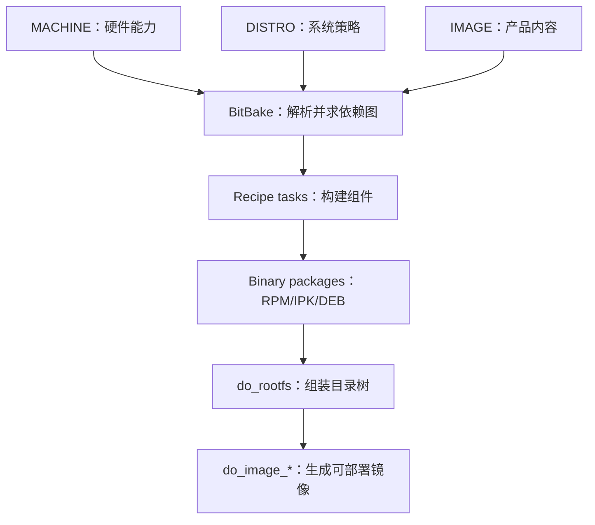
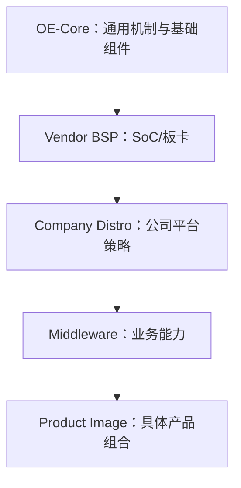
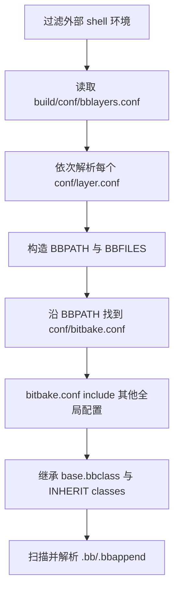
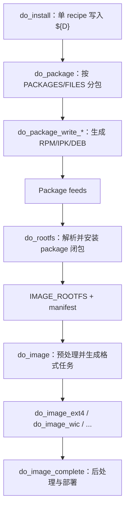
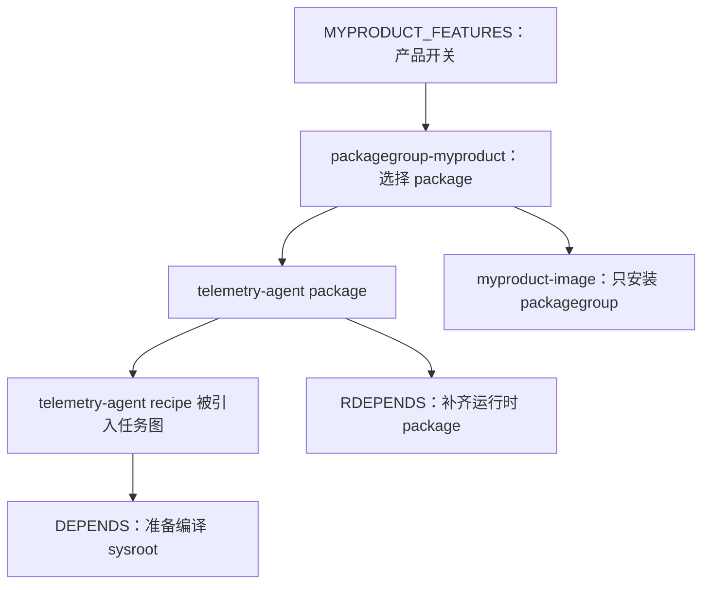
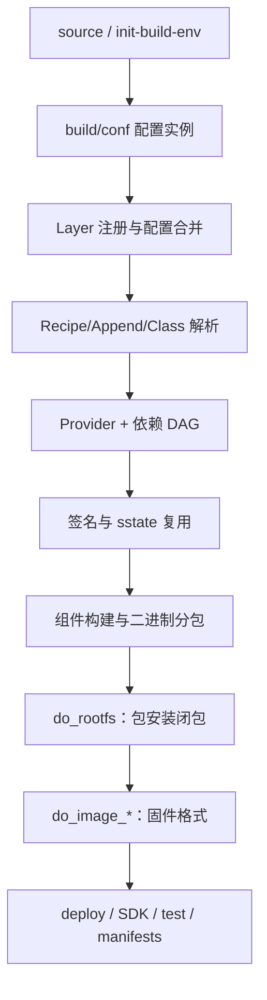

# Yocto Project 入门教程：从设计模型到产品模块集成

> 面向已经理解 C 工程、交叉编译和普通 recipe 流程的嵌入式工程师。重点不是重复 `fetch → compile → install`，而是建立 Yocto 的整体架构、配置分层、Image/RootFS 机制和产品化集成模型。
>
> 版本基线：Yocto Project 6.0 “Wrynose” / BitBake 2.18。文末专门给出 Gatesgarth 3.2 语法对照。
>
> 信息核对日期：2026-09-10。

## 目录

- [0. 需求拆解与教程 Topics](#0-需求拆解与教程-topics)
- [1. 先给出总模型：Yocto 究竟是什么](#1-先给出总模型yocto-究竟是什么)
- [2. Yocto 为什么被设计出来](#2-yocto-为什么被设计出来)
- [3. 从早期核心到当前稳定版](#3-从早期核心到当前稳定版)
- [4. 加入用户 Layer 前，最小 Yocto 系统是什么](#4-加入用户-layer-前最小-yocto-系统是什么)
- [5. 从 source 初始化开始：构建环境如何生成](#5-从-source-初始化开始构建环境如何生成)
- [6. 配置分层：每一层解决什么问题](#6-配置分层每一层解决什么问题)
- [7. BitBake 的真实配置解析过程](#7-bitbake-的真实配置解析过程)
- [8. local.conf 能改什么，不能承担什么](#8-localconf-能改什么不能承担什么)
- [9. Layer、优先级、Override 与 bbappend](#9-layer优先级override-与-bbappend)
- [10. Recipe、Package、RootFS、Image 的边界](#10-recipepackagerootfsimage-的边界)
- [11. Image 与 RootFS 的特殊构建过程](#11-image-与-rootfs-的特殊构建过程)
- [12. 常用的特殊 BitBake 操作](#12-常用的特殊-bitbake-操作)
- [13. 工程案例：优雅控制新模块的构建、打包和入镜像](#13-工程案例优雅控制新模块的构建打包和入镜像)
- [14. 调试与验证清单](#14-调试与验证清单)
- [15. 最终心智模型：一条完整构建流水线](#15-最终心智模型一条完整构建流水线)
- [16. Gatesgarth 3.2 兼容说明](#16-gatesgarth-32-兼容说明)
- [17. 官方资料与优秀教程](#17-官方资料与优秀教程)

---

## 0. 需求拆解与教程 Topics

本教程不是按 Yocto 手册目录复述，而是把问题归并为以下工程问题：

| Topic | 要回答的核心问题 | 对应章节 |
|---|---|---|
| 设计动机 | 为什么不能只用 Makefile/脚本拼 RootFS | 1、2 |
| 历史与现状 | 早期 Poky/OE/BitBake 怎样演变到 6.0 | 3 |
| 最小系统 | 不加入用户 Layer 时，最小闭环到底包含什么 | 4 |
| 初始化机制 | `source` 改了什么，配置为何会自动出现 | 5 |
| 配置分层 | site/local/layer/machine/distro/image 各负责什么 | 6 |
| 解析与覆盖 | BitBake 按什么顺序读配置，最终值如何产生 | 7—9 |
| 特殊产物 | package 怎样变成 RootFS，再变成可烧写 Image | 10—12 |
| 产品集成 | 怎样独立控制模块构建、分包和进入指定 Image | 13、14 |
| 总体架构 | 从 shell 到 deploy 的阶段、职责与产出 | 15 |
| 版本落地 | 现代 6.0 示例怎样安全映射到 Gatesgarth | 16 |

在原需求之外，教程主动补入六个容易造成工程问题的知识点：**demand-driven build、Provider/版本选择、task signature 与 sstate、host 环境隔离、packagegroup 产品接口、manifest 反向验证**。它们分别回答“为什么没构建”“为什么选错 recipe”“为什么没重编”“为什么环境变量无效”“怎样管理复杂产品包”“怎样证明包真的进了固件”。

## 1. 先给出总模型：Yocto 究竟是什么

Yocto Project 不是一个可以直接安装的软件，也不是 Ubuntu 那样的二进制发行版。官方最简洁的定义是：它不是一个嵌入式 Linux 发行版，而是帮助你创建定制发行版的工具和协作项目。[Yocto Project 首页](https://www.yoctoproject.org/)把它定位为跨硬件架构创建定制 Linux 系统的工具集；底层实际构建系统是 BitBake + OpenEmbedded-Core。[官方技术概览](https://www.yoctoproject.org/development/technical-overview/)

对嵌入式 C 工程师，可以把它理解成一台“操作系统编译器”：

| Yocto 概念         | 类比 C/MCU 工程     | 实际作用                                 |
| ---------------- | --------------- | ------------------------------------ |
| BitBake          | 编译器驱动程序 + 任务调度器 | 解析元数据、建立依赖图、运行任务                     |
| Recipe `.bb`     | 一个组件的构建描述       | 描述软件来源、依赖、配置、编译、安装和打包                |
| Class `.bbclass` | 通用库/构建框架        | 抽取 CMake、内核、镜像、systemd 等公共逻辑         |
| Layer `meta-*`   | 可叠加的软件平台模块      | 隔离 BSP、发行版策略、中间件、产品应用                |
| `MACHINE`        | 板级工程/芯片后端       | 选择 CPU、ABI、内核、设备树、启动件等硬件能力           |
| `DISTRO`         | 平台级编译策略         | 选择 libc、init、包格式、安全和全局软件策略           |
| Image recipe     | 产品固件配置          | 定义目标系统最终安装哪些功能和软件包                   |
| Package          | `.o`/库产物的产品化类比  | recipe 生成的 RPM/IPK/DEB，是 RootFS 的输入  |
| RootFS           | 已链接的运行时目录树      | 包管理器把所选 package 安装到目标根目录             |
| Image            | 可烧写固件           | 将 RootFS 转换成 ext4、wic、tar、squashfs 等 |

核心因果关系是：



一句话记忆：**MACHINE 决定“跑在哪”，DISTRO 决定“系统遵守什么策略”，IMAGE 决定“这台产品装什么”，recipe 决定“每个组件怎样被制造”。**

## 2. Yocto 为什么被设计出来

### 2.1 它要解决的不是“能不能交叉编译”，而是“能不能长期制造同一个系统”

手写交叉编译脚本能做出一个程序，却很难稳定管理整个 Linux 产品：

- 数百个上游项目各用不同构建系统和依赖版本；
- 多种 CPU、板卡、产品型号需要复用同一批软件；
- 供应商 BSP、公司平台策略、具体产品定制必须互不污染；
- 修改配置后，只应重建真正受影响的任务；
- 量产版本必须可追溯、可重复、可做许可证和安全审计；
- 最终需要的不只是二进制，还包括 rootfs、烧写镜像、SDK、包清单、许可证清单和测试结果。

Yocto 的设计初衷因此可以压缩成四个词：

1. **定制**：只把产品真正需要的功能放入镜像。
2. **复用**：硬件、发行版策略、软件和产品通过 Layer 分离。
3. **可重复**：固定源码、依赖和构建输入，以元数据重现产物。
4. **可扩展**：同一套机制支持单包、完整镜像、SDK、多个硬件和 CI。

官方明确强调 “mechanism over policy”：框架提供机制，但不会替产品替你决定 init 系统、libc、包格式或镜像内容。[Yocto 6.0 Overview](https://docs.yoctoproject.org/6.0/overview-manual/yp-intro.html)

### 2.2 最关键的原创设计不是 recipe，而是 Layer Model

单个 recipe 只能解决“一个组件怎么构建”。真正让 Yocto 适合大型产品的是 Layer Model：同一份基础元数据可以被 BSP Layer、Distro Layer、Middleware Layer 和 Product Layer 分别扩展，而不必修改上游核心。[官方 Layer Model](https://docs.yoctoproject.org/6.0/overview-manual/yp-intro.html#the-yocto-project-layer-model)

推荐的职责切分：



这不是简单的“后一个目录覆盖前一个目录”。BitBake 把所有启用 Layer 的元数据合并到同一个数据模型，再依据解析顺序、赋值运算符、Override、Provider 选择和任务依赖计算最终结果。

## 3. 从早期核心到当前稳定版

### 3.1 历史主线

- OpenEmbedded 先提供了基于 BitBake 的交叉构建框架。
- Yocto Project 于 2010 年发布早期版本，1.0 “Bernard” 于 2011 年发布。
- Yocto 1.0 之后，Yocto 与 OpenEmbedded 共同维护更小、更受控的公共元数据集合 OE-Core；大量原来位于 Poky 中的核心能力转入 OE-Core。[官方组件历史说明](https://docs.yoctoproject.org/6.0/overview-manual/yp-intro.html#open-embedded-build-system-components)
- Poky 长期承担“参考发行版 + 集成样例 + 测试载体”的角色，而不是量产产品发行版。
- Yocto 6.0 起，官方更推荐用 `bitbake-setup` 管理 BitBake、OE-Core、meta-yocto 等独立仓库；经典 Poky 式目录仍值得理解，很多芯片厂 BSP—including Gatesgarth—仍采用它。

### 3.2 早期设计的核心组成

| 组成 | 早期职责 | 今天的对应物 |
|---|---|---|
| BitBake | 解析 recipe、依赖和任务并执行 | 仍是核心执行引擎 |
| Poky metadata | 参考系统、基础 recipe 和策略 | 通用部分形成 OE-Core；Poky 只保留参考发行版定位 |
| BSP metadata | CPU/板卡支持 | Vendor BSP Layer、`conf/machine` |
| Image/Package 工具链 | 包与根文件系统生成 | `package_*`、`rootfs_*`、`image*`、Wic |
| QEMU/测试 | 参考硬件验证 | `runqemu`、`testimage`、oe-selftest、Autobuilder |
| SDK/ADT | 应用交叉开发环境 | 标准 SDK、eSDK、`devtool` |

早期模型没有被推翻，只是核心元数据被拆分、质量体系增强、开发与合规工具更加完整。

### 3.3 当前稳定版本：Yocto 6.0 “Wrynose”

截至 2026-09-10，官方 Release Catalogue 显示：当前稳定 LTS 系列为 **6.0 Wrynose**，2026 年 4 月发布，最新维护版为 **6.0.3（2026 年 8 月）**，LTS 支持至 2030 年 4 月；6.1 Blacksail 尚处于开发状态。[官方发布目录](https://www.yoctoproject.org/development/releases/)

当前功能组成应按“核心、开发、产物、质量”理解：

| 层面 | 主要组成 | 解决的问题 |
|---|---|---|
| 核心执行 | BitBake 2.18 | 元数据解析、Provider/版本选择、依赖图、并行调度、签名与 sstate |
| 核心元数据 | OpenEmbedded-Core `meta` | 基础 recipe、class、QEMU machine、distro 默认机制 |
| 参考配置 | `meta-yocto/meta-poky`、`meta-yocto-bsp` | Poky 参考发行版和参考 BSP |
| 环境管理 | `bitbake-setup`、`oe-init-build-env` | 获取仓库、创建 build、生成配置、初始化 shell |
| 开发工具 | `devtool`、`recipetool`、`bitbake-layers`、VS Code 扩展、Toaster | 新增/修改 recipe、Layer 管理、可视化和 IDE 工作流 |
| 构建复用 | stamps、task signatures、sstate、hash equivalence | 增量构建、共享缓存、判断什么必须重建 |
| 产品产物 | RPM/IPK/DEB、RootFS、Wic、SDK/eSDK、包仓库 | 安装包、烧写镜像和应用开发工具链 |
| 运行与测试 | QEMU、`runqemu`、`testimage`、oe-selftest | 构建后启动和自动验证 |
| 合规与安全 | license manifest、SPDX SBOM、CVE/VEX、QA classes | 许可证、安全、可追踪性和输出质量 |
| 权限模拟 | Pseudo | 无需 root 即可生成正确 UID/GID 的 RootFS |

上述组成及职责可由[官方组件概览](https://docs.yoctoproject.org/6.0/overview-manual/yp-intro.html#components-and-tools)和[Yocto 6.0 Release Notes](https://docs.yoctoproject.org/6.0/migration-guides/release-notes-6.0.html)交叉核对。

## 4. 加入用户 Layer 前，最小 Yocto 系统是什么

“最小组成”有三个不同口径，不能混为一谈。

### 4.1 BitBake 理论最小系统

只要有：

- BitBake；
- 一组能建立 `BBPATH`、`BBFILES` 的配置；
- `conf/bitbake.conf`；
- 至少一个可执行 target/recipe。

它甚至不要求 Linux。BitBake 是通用任务执行器，Yocto/OE-Core 才赋予它构建 Linux 系统的语义。

### 4.2 能生成 Linux Image 的 OE 最小系统

最小闭环是：

1. BitBake；
2. OpenEmbedded-Core 的 `meta` Layer；
3. `build/conf/bblayers.conf` 与 `local.conf`；
4. 一个 OE-Core 支持的 QEMU `MACHINE`；
5. 一个 image target，例如 `core-image-minimal`。

官方目录说明将 OE-Core 的 `meta/` 定义为最小底层元数据，它已经包含基础 recipe、class 和 QEMU machine 配置。[Source Directory Structure](https://docs.yoctoproject.org/6.0/ref-manual/structure.html)

此时可令 `DISTRO = ""`，使用 OE-Core 的 `meta/conf/distro/defaultsetup.conf` 默认策略；它不是 Poky 产品配置。

### 4.3 标准 Poky 参考构建的最小组成

| 目录/仓库 | 是否必需 | 原因 |
|---|---:|---|
| `bitbake/` | 是 | 构建引擎 |
| `openembedded-core/meta` | 是 | 基础 Linux 元数据 |
| `meta-yocto/meta-poky` | 当 `DISTRO = "poky"` 时需要 | 提供 `poky.conf` |
| `meta-yocto/meta-yocto-bsp` | 仅构建参考实体 BSP 时需要 | 提供参考硬件 BSP；QEMU 并不依赖它 |
| `meta-selftest` | 否 | 仅 OE 自测试 |
| `meta-skeleton` | 否 | recipe/BSP 示例模板 |
| 用户 `meta-*` | 否 | 此时尚未加入产品定制 |

因此，“Poky 默认 `bblayers.conf` 列了三个 Layer”不等于“三个 Layer 都是理论最小依赖”。其中 `meta-yocto-bsp` 是参考 BSP，而不是构建 QEMU `core-image-minimal` 的底层必要条件。

## 5. 从 source 初始化开始：构建环境如何生成

### 5.1 为什么必须使用 `source`

```bash
source openembedded-core/oe-init-build-env build-myboard
```

不能简单写成 `./oe-init-build-env`。原因是脚本要修改**当前 shell**的 `PATH`、`BUILDDIR` 等环境并 `cd` 到 Build Directory；子进程退出后不能把这些状态带回父 shell。

### 5.2 经典 `oe-init-build-env` 路径

这是 Gatesgarth 和大量厂商 BSP 最常见的流程。按职责拆解如下：

| 步骤 | 执行者 | 作用 | 产出 |
|---:|---|---|---|
| 1 | `oe-init-build-env` | 确认脚本被 source，定位 OE 根目录 | `OEROOT`/源目录上下文 |
| 2 | 内部环境脚本 | 检查 shell/主机环境，加入 `scripts`、`bitbake/bin` 到 `PATH` | 当前 shell 可运行 BitBake 工具 |
| 3 | 参数处理 | 使用参数作为 Build Directory；未给参数时通常为 `build` | `BUILDDIR` |
| 4 | `oe-setup-builddir` | 选择模板目录 | `TEMPLATECONF` |
| 5 | 首次初始化 | 从模板复制并替换占位符 | `build/conf/local.conf`、`bblayers.conf` |
| 6 | 模板记录 | 保存所用模板信息 | `build/conf/templateconf.cfg`（经典流程常见） |
| 7 | 进入构建目录 | `cd ${BUILDDIR}`，显示模板说明 | 可直接执行 `bitbake` 的 shell |

官方确认 `source` 会设置环境、创建 Build Directory、切换当前目录，并把 `scripts/` 和 `bitbake/bin/` 放入 `PATH`。[oe-init-build-env 说明](https://docs.yoctoproject.org/6.0/ref-manual/structure.html#oe-init-build-env)

### 5.3 `local.conf` 是怎样生成的

首次 source 时，核心机制不是“脚本从零写一份配置”，而是**模板实例化**：

```text
${TEMPLATECONF}/local.conf.sample
        │  copy + sed 替换 ##OEROOT##
        ▼
${BUILDDIR}/conf/local.conf

${TEMPLATECONF}/bblayers.conf.sample
        │  copy + sed 替换 ##OEROOT##
        ▼
${BUILDDIR}/conf/bblayers.conf
```

关键规则（以下默认路径针对本文的 6.0/OE-Core 基线）：

- `TEMPLATECONF` 必须在外部 shell 环境中设置，默认指向 OE-Core 的 `meta/conf/templates/default`；
- `oe-setup-builddir` 用 `sed` 将样例中的 `##OEROOT##` 替换为实际路径；
- 只有配置不存在时才由样例生成，后续 source 不应覆盖已有 `local.conf`/`bblayers.conf`；
- 当前模板还可提供 `conf-summary.txt` 和 `conf-notes.txt`，用于 source 后显示项目说明和可构建目标；
- 公司项目应维护自己的模板目录，让新开发者和 CI 从同一入口生成配置。

以上机制可直接对照[官方 Build Directory 说明](https://docs.yoctoproject.org/6.0/ref-manual/structure.html#build-conf-local-conf)和[`TEMPLATECONF` 定义](https://docs.yoctoproject.org/6.0/ref-manual/variables.html#term-TEMPLATECONF)。

示例：

```bash
export TEMPLATECONF="$PWD/meta-myproduct/conf/templates/release"
source openembedded-core/oe-init-build-env build-release
```

### 5.4 Yocto 6.0 推荐的 `bitbake-setup` 路径

Yocto 6.0 官方首选方式是用 `bitbake-setup` 根据 JSON 配置模板获取并固定独立仓库，再创建 setup：

```bash
python3 -m venv ./bitbake-setup-venv
. ./bitbake-setup-venv/bin/activate
pip install bitbake-setup
bitbake-setup init
source ./bitbake-builds/<setup-name>/build/init-build-env
```

典型结构：

```text
bitbake-builds/
├── site.conf
└── <setup-name>/
    ├── build/
    ├── config/
    └── layers/
```

其设计提升点是：仓库来源与 revision 被配置描述，多个 setup 可以共享站点级 `site.conf`/sstate，初始化与更新更可复现。[BitBake 2.18 环境设置](https://docs.yoctoproject.org/bitbake/2.18/bitbake-user-manual/bitbake-user-manual-environment-setup.html)

对你的 Gatesgarth 工程：继续使用 BSP 提供的 `source` 脚本，不要为了“形式更新”单独移植 `bitbake-setup`；理解新机制即可。

## 6. 配置分层：每一层解决什么问题

### 6.1 先按作用域分层，而不是按目录背诵

| 配置层 | 典型文件 | 作用域 | 应该放什么 |
|---|---|---|---|
| 站点层 | `build/conf/site.conf` | 同一构建站点/多 build | `DL_DIR`、`SSTATE_DIR`、镜像服务器、并发资源 |
| CI 注入层 | `build/conf/auto.conf` | 一次自动构建 | CI 生成的版本、分支、开关；本地不手写 |
| 本地实验层 | `build/conf/local.conf` | 当前 Build Directory | MACHINE、DISTRO、调试开关、临时包、路径 |
| Layer 注册层 | `meta-x/conf/layer.conf` | 当前 Layer | recipe 搜索、Layer 依赖、兼容系列、优先级 |
| Machine 层 | `meta-bsp/conf/machine/*.conf` | 某板/SoC | CPU tune、内核/启动件 provider、设备树、硬件 feature |
| Distro 层 | `meta-distro/conf/distro/*.conf` | 全产品平台 | libc、init、包格式、安全、全局 PACKAGECONFIG/版本策略 |
| Image 层 | `recipes-core/images/*.bb` | 某产品镜像 | 最终 packagegroup、image feature、镜像格式/大小 |
| Recipe 层 | `recipes-*/*.bb` | 某组件 | 构建、安装、分包、组件依赖 |
| Recipe 扩展层 | `*.bbappend` | 某 recipe | 在不改上游 recipe 的情况下修改它 |
| Class 层 | `classes-*/.bbclass` | 继承它的 recipe 或全局 | 通用机制与可复用任务 |
| Config Fragment | `conf/fragments/*.conf` | 可组合配置集合 | 可追踪的产品/开发能力开关 |

### 6.2 三条工程边界

1. **硬件事实放 Machine**：UART 数量、GPU、Wi-Fi 能力、设备树、内核 provider。
2. **公司平台政策放 Distro**：systemd/sysvinit、glibc/musl、包格式、安全强化、许可证策略。
3. **产品装什么放 Image/packagegroup**：应用、服务、诊断工具、功能组合。

把产品包列表塞入 `machine.conf`，或者把公司通用策略长期塞在 `local.conf`，都会破坏复用边界。

## 7. BitBake 的真实配置解析过程

### 7.1 Base Configuration 阶段

执行 `bitbake <target>` 后，BitBake 首先处理基础配置：[BitBake Execution](https://docs.yoctoproject.org/bitbake/2.18/bitbake-user-manual/bitbake-user-manual-execution.html)



具体含义：

1. BitBake 默认清理 host 环境，只有白名单变量进入 datastore。
2. 从当前工作目录寻找 `conf/bblayers.conf`，取得 `BBLAYERS`。
3. 对每个 Layer 解析 `conf/layer.conf`；由它们构造 `BBPATH` 和 `BBFILES`。
4. 通过 `BBPATH` 找到 `conf/bitbake.conf`。
5. OE-Core 的 `bitbake.conf` 再 include `site.conf`、`auto.conf`、`local.conf`、Machine、Distro 等配置。
6. 解析全局继承的 class。
7. 按 `BBFILES` 找出 recipe 与 bbappend；每个 recipe 都以基础配置的副本为起点独立解析。
8. 解析结束后才做 Provider/版本选择、依赖图和 RunQueue 调度。

### 7.2 “后写就一定覆盖”是错误模型

最终值同时受以下因素影响：

- 文件解析顺序；
- `=`, `?=`, `??=`, `:=`, `+=` 等赋值运算符；
- `:append`, `:prepend`, `:remove`；
- 当前 `OVERRIDES`；
- recipe/package/task 特定 override；
- 匿名 Python 和 class 逻辑。

例如官方文档指出 `site.conf → auto.conf → local.conf` 按此顺序读取，因此三者使用相同的强赋值时，`local.conf` 较晚。但 Distro 配置在 OE-Core 总体 include 链中又可以覆盖 `local.conf` 的普通赋值，所以不要把 local.conf 想成无条件最高优先级。[User Configuration](https://docs.yoctoproject.org/6.0/overview-manual/concepts.html#user-configuration)

### 7.3 常用运算符的工程语义

| 写法 | 含义 | 适用场景 |
|---|---|---|
| `A = "x"` | 延迟展开的强赋值 | 明确策略值 |
| `A := "${B}"` | 当场展开 | 必须冻结当前上下文时 |
| `A ?= "x"` | 第一次遇到未定义时赋默认 | 普通默认值 |
| `A ??= "x"` | 弱默认，解析结束前仍可被另一弱默认替换 | class/框架默认 |
| `A += "x"` | 立即追加并自动加空格 | 普通列表；注意赋值时机 |
| `A:append = " x"` | Override 展开阶段追加，不自动加空格 | bbappend/local.conf 中稳定追加 |
| `A:remove = "x"` | 最终移除指定 token | 禁用默认功能 |
| `A:pn-foo = "x"` | 只对 recipe `foo` 生效 | 配置某个 recipe |

调试时不要猜，直接看最终 datastore：

```bash
bitbake-getvar -r telemetry-agent PACKAGECONFIG
bitbake -e telemetry-agent | less
bitbake -e telemetry-agent | sed -n '/^#.*PACKAGECONFIG/,/^PACKAGECONFIG=/p'
```

`bitbake -e` 顶部还能显示实际解析过的配置/class 文件，是定位“谁改了变量”的第一工具。

## 8. local.conf 能改什么，不能承担什么

### 8.1 适合在 local.conf 中修改

```bitbake
# 选择当前 build 的目标
MACHINE = "qemux86-64"
DISTRO = "poky"

# 构建资源与缓存
DL_DIR = "/srv/yocto/downloads"
SSTATE_DIR = "/srv/yocto/sstate-cache"
BB_NUMBER_THREADS = "12"
PARALLEL_MAKE = "-j 12"

# 输出包格式
PACKAGE_CLASSES = "package_rpm"

# 当前开发 build 的额外能力
EXTRA_IMAGE_FEATURES:append = " ssh-server-openssh debug-tweaks"

# 只影响特定 recipe
PACKAGECONFIG:append:pn-curl = " openssl"
PREFERRED_VERSION_python3 = "3.13.%"

# 离线/镜像实验
BB_NO_NETWORK = "1"
```

适合放在这里的内容是“当前工作目录的选择与实验”，官方也建议要共享或发布的修改迁移到 Distro 配置或受版本控制的配置 fragment。[Build Directory local.conf](https://docs.yoctoproject.org/6.0/ref-manual/structure.html#build-conf-local-conf)

### 8.2 自定义变量当然可以写，但必须有人消费

```bitbake
MYPRODUCT_FEATURES = "telemetry diagnostics"
MY_API_LEVEL = "3"
```

BitBake 接受自定义变量，但它们不会自动产生任何行为。必须由 recipe、class、packagegroup 或匿名 Python 读取它们。

### 8.3 把变量传入任务环境：两个阶段

BitBake 为避免 host 污染会清理任务环境。若要把 host 的 `CORP_SDK_ROOT` 传入任务，需要：

```bash
# 第一阶段：在启动 BitBake 之前，允许变量进入 BitBake datastore
export CORP_SDK_ROOT=/opt/corp-sdk
export BB_ENV_PASSTHROUGH_ADDITIONS="$BB_ENV_PASSTHROUGH_ADDITIONS CORP_SDK_ROOT"
```

```bitbake
# 第二阶段：在 local.conf/distro/recipe 中允许它进入 shell task 环境
export CORP_SDK_ROOT
```

注意：`BB_ENV_PASSTHROUGH_ADDITIONS` 必须在外部环境中生效，因为 BitBake 在解析配置之前就决定哪些 host 变量可以进入 datastore。官方给出的也是这套两步模型。[Passing Information Into Tasks](https://docs.yoctoproject.org/bitbake/2.18/bitbake-user-manual/bitbake-user-manual-metadata.html#passing-information-into-the-build-task-environment)

如果值是构建配置本身，最好直接在 metadata 中定义，而不是依赖开发机环境。环境透传会参与任务签名，还可能导致不同主机得到不同产物。

### 8.4 不应长期放在 local.conf

- 产品必须安装的 package 列表；
- 公司发布版的安全、init、libc 和版本策略；
- BSP 硬件事实；
- 需要团队/CI 一致复现的 feature 默认值；
- 对第三方 recipe 的正式修改。

这些应分别进入 image/packagegroup、distro、machine 或 `.bbappend`。

## 9. Layer、优先级、Override 与 bbappend

### 9.1 `layer.conf` 的最小职责

```bitbake
BBPATH .= ":${LAYERDIR}"
BBFILES += "${LAYERDIR}/recipes-*/*/*.bb ${LAYERDIR}/recipes-*/*/*.bbappend"

BBFILE_COLLECTIONS += "myproduct"
BBFILE_PATTERN_myproduct = "^${LAYERDIR}/"
BBFILE_PRIORITY_myproduct = "8"

LAYERDEPENDS_myproduct = "core"
LAYERSERIES_COMPAT_myproduct = "wrynose"
```

`BBFILE_PATTERN_*` 等 Layer collection 后缀在当前版本仍使用下划线；它们不是新 Override 语法。

### 9.2 三个经常混淆的“优先级”

| 机制 | 决定什么 | 不决定什么 |
|---|---|---|
| `BBLAYERS` 顺序 | Layer 配置/append 的发现和部分解析顺序 | 不等价于所有变量的绝对优先级 |
| `BBFILE_PRIORITY_*` | 多个 Layer 提供同名 recipe 时，哪个 recipe 优先 | 不保证某个普通 `.conf` 赋值必然胜出 |
| `OVERRIDES` | 某个条件化变量值何时适用 | 不负责选择 recipe 版本/provider |

Provider/版本另由 `PROVIDES`、`PREFERRED_PROVIDER_*`、`PREFERRED_VERSION_*`、`DEFAULT_PREFERENCE` 等机制解决。

### 9.3 `.bbappend` 的正确定位

`.bbappend` 用来修改已有 recipe，而不 fork/修改上游 Layer：

```bitbake
FILESEXTRAPATHS:prepend := "${THISDIR}/${PN}:"
SRC_URI:append = " file://0001-product-fix.patch"
PACKAGECONFIG:append = " feature-x"
```

它适合补丁、配置和安装规则修改；不适合承担“产品最终安装哪些包”的总清单，后者应进入 packagegroup/image。

### 9.4 `BBMASK` 不是产品功能开关

`BBMASK` 让 BitBake 完全不解析匹配的 `.bb`/`.bbappend`。它适合临时屏蔽冲突 recipe、坏掉的版本或供应商 metadata，不适合表示“本产品暂不安装 telemetry”。产品关闭一个模块时，让它不进入依赖图即可；没必要让 BitBake看不见它。[`BBMASK` 官方定义](https://docs.yoctoproject.org/6.0/ref-manual/variables.html#term-BBMASK)

## 10. Recipe、Package、RootFS、Image 的边界

这是理解“模块是否参与构建、打包、进入镜像”的关键。

| 状态 | 判断标准 | 控制机制 |
|---|---|---|
| Recipe 可见 | `.bb` 被 `BBFILES` 扫描且未被 mask | Layer 是否启用、`BBMASK` |
| Recipe 被构建 | 它或其 package 被目标依赖图引用 | target、`DEPENDS`、`RDEPENDS`、image/packagegroup |
| 输出被打包 | `do_package` 按 `PACKAGES`/`FILES:*` 分割 `${D}` | `PACKAGES`、`FILES:*`、package classes |
| Package 进入 RootFS | 它出现在最终 `PACKAGE_INSTALL` 依赖闭包 | `IMAGE_INSTALL`、`IMAGE_FEATURES`、packagegroup、RDEPENDS |
| RootFS 变成镜像 | 某个 `do_image_<type>` 消费 RootFS | `IMAGE_FSTYPES`、Wic、image class |

重要结论：**recipe 出现在 Layer 中，只意味着 BitBake 能看见它；正常的 demand-driven build 不会因此自动编译它。** `bitbake world` 是例外，它会尝试把可构建 recipe 都作为目标；`EXCLUDE_FROM_WORLD = "1"` 只阻止 recipe 被 world 直接选中，若仍是其他组件依赖，它照样会构建。[`EXCLUDE_FROM_WORLD`](https://docs.yoctoproject.org/6.0/ref-manual/variables.html#term-EXCLUDE_FROM_WORLD)

依赖的命名空间也不同：

- `DEPENDS` 写 **recipe/provider 名**，保证依赖的 `do_populate_sysroot` 在当前组件配置前完成；
- `RDEPENDS:${PN}` 写 **package 名**，保证包管理器安装运行所需 package，并引出相应构建任务；
- 自动共享库扫描通常会生成动态库运行依赖，不要重复手写所有 `.so` 依赖；
- `RRECOMMENDS` 是可选推荐，可能因 package 不存在而被跳过；`RDEPENDS` 缺失则 RootFS 失败。

参见官方 [`DEPENDS`](https://docs.yoctoproject.org/6.0/ref-manual/variables.html#term-DEPENDS) 与 [`RDEPENDS`](https://docs.yoctoproject.org/6.0/ref-manual/variables.html#term-RDEPENDS) 定义。

## 11. Image 与 RootFS 的特殊构建过程

### 11.1 Image 不是“把 `${D}` 打成 tar 包”

普通 recipe 的 `${D}` 只是该 recipe 的伪安装目录。Image 构建必须先让所有 recipe 生成二进制 package，再由真正的 package manager 把 package 安装到统一 RootFS。



### 11.2 `do_rootfs`

`do_rootfs` 的输入不是 recipe 名单，而是最终 package 集合。主要变量链：

```text
IMAGE_INSTALL + IMAGE_FEATURES + packagegroup + RDEPENDS
                         │
                         ▼
                  PACKAGE_INSTALL
                         │
                         ▼
             rpm/dnf、opkg 或 apt/dpkg
                         │
                         ▼
                   IMAGE_ROOTFS
```

它还会：

- 执行能在 host 上完成的 package postinstall；
- 执行 `ROOTFS_POSTPROCESS_COMMAND`；
- 生成与镜像同目录的 `.manifest` 包清单；
- 对只读 RootFS 要求所有 postinstall 在构建主机成功，不能留到首次启动。

官方对整个过程及关键变量有完整说明：[Image Generation](https://docs.yoctoproject.org/6.0/overview-manual/concepts.html#image-generation)。

### 11.3 `do_image` 与 `do_image_*`

- `do_image` 在 `do_rootfs` 之后启动镜像阶段并执行 `IMAGE_PREPROCESS_COMMAND`；
- 根据 `IMAGE_FSTYPES` 动态生成 `do_image_ext4`、`do_image_wic`、`do_image_tar` 等任务；
- `do_image_complete` 最后执行 `IMAGE_POSTPROCESS_COMMAND` 并完成部署；
- 整个 RootFS/Image 过程运行在 Pseudo 环境中，以保留目标 UID/GID。

```bitbake
IMAGE_FSTYPES = "tar.xz ext4 wic"
```

`IMAGE_FSTYPES` 有特殊解析时机；官方要求用 `+=` 增加类型，不要用 `:append`/`:prepend`。[`IMAGE_FSTYPES`](https://docs.yoctoproject.org/6.0/ref-manual/variables.html#term-IMAGE_FSTYPES)

### 11.4 Image 中的三种内容入口

| 入口 | 最佳位置 | 用途 |
|---|---|---|
| `IMAGE_INSTALL` | image recipe | 精确加入 package/packagegroup |
| `IMAGE_FEATURES` | image recipe | 加入 ssh、只读 rootfs、开发包等高层能力 |
| `EXTRA_IMAGE_FEATURES` | local.conf | 开发者临时追加 image feature |

正式复杂产品优先使用自定义 packagegroup。官方也明确把 packagegroup 推荐为复杂定制 Image 的最佳方式。[Custom Package Groups](https://docs.yoctoproject.org/6.0/dev-manual/customizing-images.html#customizing-images-using-custom-package-groups)

## 12. 常用的特殊 BitBake 操作

### 12.1 Image/RootFS/产物

```bash
# 完整构建镜像；通常这是正确入口
bitbake myproduct-image

# 查看 image 定义的全部任务
bitbake -c listtasks myproduct-image

# 只执行/强制重新执行 RootFS 任务（调试用）
bitbake -c rootfs myproduct-image
bitbake -f -c rootfs myproduct-image

# 列出当前 image 可用 feature
bitbake -c list_image_features myproduct-image

# 更新本地二进制 package feed 索引
bitbake package-index
```

调试后要获得一致的最终产物，应再次执行完整 `bitbake myproduct-image`，让下游 `do_image_*` 与 `do_image_complete` 按签名关系运行。

### 12.2 SDK/eSDK

```bash
bitbake -c populate_sdk myproduct-image
bitbake -c populate_sdk_ext myproduct-image
```

标准 SDK 包含 host 侧交叉工具链与 target 侧头文件/库；eSDK 进一步封装受控构建环境和 `devtool` 工作流。[SDK Generation](https://docs.yoctoproject.org/6.0/overview-manual/concepts.html#sdk-generation)

### 12.3 QEMU 与运行测试

```bash
runqemu qemux86-64 myproduct-image nographic
bitbake -c testimage myproduct-image
```

自动在 image 完成后测试可设置：

```bitbake
INHERIT += "testimage"
TESTIMAGE_AUTO = "1"
```

### 12.4 内核与配置类组件

```bash
bitbake virtual/kernel -c menuconfig
bitbake virtual/kernel -c diffconfig
bitbake virtual/kernel -c kernel_configcheck -f
bitbake virtual/kernel -c deploy
```

这些操作只适用于定义了对应任务的 recipe；先用 `-c listtasks` 验证。

### 12.5 依赖与环境分析

```bash
bitbake-layers show-layers
bitbake-layers show-recipes telemetry-agent
bitbake-layers show-appends
bitbake -e telemetry-agent > telemetry-agent.env
bitbake -g myproduct-image
oe-pkgdata-util list-pkgs
oe-pkgdata-util list-pkg-files telemetry-agent
```

`bitbake -g` 生成依赖图数据，适合回答“为什么这个 recipe 被构建”；`.manifest` 适合回答“为什么这个 package 最终进了 image”。

### 12.6 清理：三种命令并不等价

| 命令 | 删除 WORKDIR 产物 | 删除本地 sstate | 删除 DL_DIR 源码 |
|---|---:|---:|---:|
| `bitbake -c clean foo` | 是 | 否 | 否 |
| `bitbake -c cleansstate foo` | 是 | 是 | 否 |
| `bitbake -c cleanall foo` | 是 | 是 | 是 |

官方明确不建议正常场景使用 `cleanall`；若只是重新抓取，应使用 `bitbake -f -c fetch foo`。共享 sstate 环境也不宜随意 `cleansstate`。[Tasks Reference](https://docs.yoctoproject.org/6.0/ref-manual/tasks.html#manually-called-tasks)

### 12.7 其他真正特殊的构建场景

- **Initramfs**：通常用 `PACKAGE_INSTALL` 固定最小包集，而不是普通 `IMAGE_INSTALL`；可用 `INITRAMFS_IMAGE`/`INITRAMFS_IMAGE_BUNDLE` 与内核绑定。
- **Wic 分区镜像**：`IMAGE_FSTYPES += "wic"`，由 `.wks` 描述分区、boot files 和 rootfs 来源。
- **Multiconfig**：同一次 BitBake 运行构建不同 MACHINE/libc/firmware，可用 `mc:<config>:<target>` 建立跨配置依赖。
- **Buildhistory**：`INHERIT += "buildhistory"`，追踪 package、image、SDK 内容和大小变化。
- **SBOM**：使用发行版支持的 SPDX class 生成软件物料清单，发布流程应同时归档 image manifest、license manifest、SBOM 和 Layer revisions。
- **只读 RootFS**：属于 Image Feature/系统设计，不只是文件系统格式；需保证 postinstall 全部在 `do_rootfs` 阶段成功。

## 13. 工程案例：优雅控制新模块的构建、打包和入镜像

### 13.1 需求

新增 `telemetry-agent`：

- 编译依赖 `curl`、`json-c`；
- 运行时需要 `ca-certificates`；
- 可选 systemd 集成；
- 产品开关决定是否构建并进入指定 image；
- 模块关闭时仍允许开发者手工执行 `bitbake telemetry-agent`；
- 不修改 OE-Core、Vendor BSP 或第三方 Layer。

### 13.2 推荐的四层结构

```text
meta-myproduct/
├── conf/
│   ├── distro/mydistro.conf
│   └── include/myproduct-features.inc
├── recipes-apps/
│   └── telemetry-agent/telemetry-agent_1.0.bb
├── recipes-core/
│   ├── packagegroups/packagegroup-myproduct.bb
│   └── images/myproduct-image.bb
└── conf/layer.conf
```

控制链：



这使“产品是否选择模块”和“模块自身怎样构建”解耦。

### 13.3 第 1 层：recipe 只描述模块本身

```bitbake
SUMMARY = "Product telemetry agent"
LICENSE = "CLOSED"

inherit cmake pkgconfig systemd

DEPENDS = "curl json-c"
RDEPENDS:${PN}:append = " ca-certificates"

PACKAGECONFIG ??= ""
PACKAGECONFIG[systemd] = \
    "-DWITH_SYSTEMD=ON,-DWITH_SYSTEMD=OFF,systemd"

SYSTEMD_SERVICE:${PN} = "telemetry-agent.service"
```

若二进制链接 `libcurl.so`/`libjson-c.so`，Yocto 的共享库扫描通常会自动补运行依赖；这里的 `DEPENDS` 仍必须存在，以向 recipe-specific sysroot 提供头文件和链接库。

systemd 选项可以在发行版配置中与平台 init 策略联动：

```bitbake
PACKAGECONFIG:pn-telemetry-agent = \
    "${@bb.utils.contains('DISTRO_FEATURES', 'systemd', 'systemd', '', d)}"
```

`PACKAGECONFIG` 正是“控制某个 recipe 内部可选能力及其可选依赖”的标准机制。[`PACKAGECONFIG`](https://docs.yoctoproject.org/6.0/ref-manual/variables.html#term-PACKAGECONFIG)

### 13.4 第 2 层：定义产品 feature，而不是滥用 BBMASK

`conf/include/myproduct-features.inc`：

```bitbake
MYPRODUCT_FEATURES ??= "telemetry"
```

在 `mydistro.conf` 中：

```bitbake
require conf/include/myproduct-features.inc
```

为什么不用 `DISTRO_FEATURES` 直接表示 telemetry？

- `DISTRO_FEATURES` 更适合 systemd、x11、wayland、bluetooth 这类影响多个 recipe 构建方式的系统能力；
- `telemetry-agent` 是具体产品组件，使用产品自定义 feature 语义更准确；
- 若某能力确实会统一改变大量 recipe 的配置，再把它提升为 `DISTRO_FEATURES`。

### 13.5 第 3 层：packagegroup 把 feature 映射为 package

`packagegroup-myproduct.bb`：

```bitbake
SUMMARY = "My product package groups"
LICENSE = "MIT"

inherit packagegroup

PACKAGES = "${PN}-base"

RDEPENDS:${PN}-base = "\
    base-files \
    ${@bb.utils.contains('MYPRODUCT_FEATURES', 'telemetry', 'telemetry-agent', '', d)} \
"
```

结果：

| `MYPRODUCT_FEATURES` | recipe 是否可见 | 完整 image 构建时是否构建 | 是否生成 package | 是否进 image |
|---|---:|---:|---:|---:|
| 含 `telemetry` | 是 | 是 | 是 | 是 |
| 不含 `telemetry` | 是 | 否 | 否 | 否 |
| 不含，但手工 `bitbake telemetry-agent` | 是 | 是 | 是 | 否 |

表中“关闭时不生成 package”是针对这次 image 的依赖图而言；如果此前构建过，deploy 目录中可能仍保留旧 package，不能用“文件还存在”判断当前 image 是否包含它。

若想让 telemetry 缺失不阻塞 image，可把它放入 `RRECOMMENDS`；对于产品必需模块应使用 `RDEPENDS`，让缺包立即失败。

### 13.6 第 4 层：Image 永远只依赖稳定的 packagegroup 接口

`myproduct-image.bb`：

```bitbake
SUMMARY = "My product production image"
LICENSE = "MIT"

inherit core-image

IMAGE_INSTALL:append = " packagegroup-myproduct-base"
IMAGE_FSTYPES += "wic"
```

Image 不需要知道 telemetry 的依赖细节，也不需要包含大量条件表达式。产品组合在 packagegroup 里集中管理。

### 13.7 三种控制分别放在哪里

| 用户目标 | 最优机制 | 示例 |
|---|---|---|
| 控制 recipe 是否可被解析 | Layer enable/disable；冲突时才用 `BBMASK` | `BBLAYERS` |
| 控制 image 构建是否拉起该 recipe | packagegroup 的条件 `RDEPENDS` | `MYPRODUCT_FEATURES` |
| 控制模块内部可选后端/依赖 | `PACKAGECONFIG` | systemd、TLS、GUI backend |
| 控制 recipe 能否支持当前平台 | `COMPATIBLE_MACHINE` / `features_check` | 只支持特定 SoC/硬件 capability |
| 控制安装文件怎样分包 | `PACKAGES` + `FILES:*` | 主程序、plugins、tools、dev |
| 控制哪个 image 安装 package | image → packagegroup | production/debug/factory image |

### 13.8 开发、发布和不同 Image 的开关位置

发布默认值放在受 Git 管理的 Distro/include：

```bitbake
MYPRODUCT_FEATURES ??= "telemetry"
```

本地开发临时关闭：

```bitbake
MYPRODUCT_FEATURES:remove = "telemetry"
```

调试镜像临时增加诊断能力，建议新增 packagegroup 或 image-specific override，而不是污染量产 image：

```bitbake
RDEPENDS:${PN}-debug = "telemetry-cli strace tcpdump"
```

### 13.9 为什么这是更优雅的方案

- Recipe 保持可独立构建、测试和复用；
- 模块关闭时没有依赖边，不执行编译/打包任务；
- Image 面向稳定的 packagegroup 接口，不耦合组件细节；
- Distro/产品 feature 是可审计的产品策略；
- `PACKAGECONFIG` 只处理 recipe 内部选项，不承担产品是否安装该模块；
- 不改 vendor/OE-Core，升级 BSP 时冲突最小。

## 14. 调试与验证清单

### 14.1 加 Layer 后

```bash
bitbake-layers show-layers
bitbake-layers show-recipes telemetry-agent
bitbake-layers show-appends
```

确认：Layer 已启用、series 兼容、recipe 有 provider、bbappend 被正确命中。

### 14.2 验证配置最终值

```bash
bitbake-getvar MYPRODUCT_FEATURES
bitbake-getvar -r telemetry-agent PACKAGECONFIG
bitbake -e packagegroup-myproduct | grep '^RDEPENDS:'
```

Gatesgarth 没有 `bitbake-getvar` 时统一用 `bitbake -e`。

### 14.3 验证“为什么被构建”

```bash
bitbake -g myproduct-image
grep -n 'telemetry-agent' pn-depends.dot task-depends.dot
```

看到 image → packagegroup → telemetry 的依赖链，才说明产品开关真正连接到了任务图。

### 14.4 验证 package 内容

```bash
bitbake telemetry-agent
oe-pkgdata-util list-pkgs | grep '^telemetry-agent'
oe-pkgdata-util list-pkg-files telemetry-agent
```

如果 `${D}` 有文件但 package 为空，检查 `PACKAGES` 顺序与 `FILES:*`；如果 image 找不到包，区分 recipe 名和 package 名。

### 14.5 验证是否进入指定 Image

```bash
bitbake myproduct-image
grep '^telemetry-agent ' \
  tmp/deploy/images/${MACHINE}/myproduct-image-${MACHINE}.manifest
```

最终权威证据是该次 image 的 manifest 和 RootFS 内容，不是 `tmp/deploy/rpm|ipk|deb` 中是否残留 package。

### 14.6 正反两次验收

1. 开启 `telemetry`：依赖图含模块、manifest 含 package、RootFS 有程序和 service。
2. 关闭 `telemetry`：依赖图不含模块、manifest 不含 package、RootFS 无对应文件。
3. 关闭状态手工 `bitbake telemetry-agent`：recipe 仍可独立成功构建。
4. 切到非 systemd Distro：`PACKAGECONFIG` 不含 `systemd`，模块仍按无 systemd 模式构建。

## 15. 最终心智模型：一条完整构建流水线

### 15.1 从 shell 到固件的完整流程

| 阶段名称 | 主要动作 | 核心输入 | 阶段产出 |
|---:|---|---|---|
| 1. Workspace Setup | `bitbake-setup` 获取版本固定的仓库，或手工准备 BSP | 配置模板、Layer revisions | Source/Layer 工作区 |
| 2. Shell Initialization | source 初始化脚本，设置 PATH/BUILDDIR | `TEMPLATECONF`、build 参数 | 当前构建 shell |
| 3. Build Config Generation | 首次从 sample 生成 build 配置 | `local.conf.sample`、`bblayers.conf.sample` | `build/conf/*` |
| 4. Base Configuration Parse | 读取 bblayers/layer/bitbake 和全局 conf/class | shell env、site/auto/local、Machine、Distro | 全局 datastore |
| 5. Metadata Discovery | 按 BBFILES 发现 `.bb`/`.bbappend` | 所有启用 Layer | recipe/provider 集合 |
| 6. Recipe Parse | 为每个 recipe 合并 class、append、override | recipe metadata | 每个 recipe 的任务/变量模型 |
| 7. Provider Resolution | 决定虚拟目标和多版本由谁提供 | PROVIDES/PREFERRED_* | 被选 recipe |
| 8. Dependency Expansion | 展开 task、DEPENDS、RDEPENDS 和 image 依赖 | build target | 完整任务 DAG |
| 9. Signature/SetScene | 比较任务输入签名并尝试恢复 sstate | metadata、源码校验和、依赖签名 | 复用产物或待执行任务 |
| 10. Component Build | 执行所需 recipe 的 configure/compile/install | recipe sysroot、源码 | `${D}`、sysroot、deploy 中间件 |
| 11. Package Generation | 分包、QA、写 RPM/IPK/DEB | `${D}`、PACKAGES、FILES | binary package feeds、pkgdata |
| 12. RootFS Assembly | 包管理器解析并安装闭包 | IMAGE_INSTALL/features/packagegroups | `IMAGE_ROOTFS`、manifest |
| 13. Image Generation | 转换 RootFS、分区、压缩和后处理 | IMAGE_FSTYPES、WKS | ext4/wic/tar 等镜像 |
| 14. Deployment/SDK/Test | 部署启动件、生成 SDK、启动测试 | 完成的 image 与 metadata | `tmp/deploy/*`、SDK、测试报告 |

### 15.2 一张最终图



最终记忆笔记：

> Yocto 的本质不是一堆 shell recipe，而是一个由元数据驱动的操作系统产品生成系统。Layer 负责组织所有可选知识；Machine、Distro、Image 从硬件、政策、产品三个维度确定需求；BitBake 将它们合并成任务依赖图；recipe 先生成 package，package manager 再组装 RootFS，最后 image class 把 RootFS 变成可部署固件。产品模块最清晰的控制链是“产品 feature → packagegroup → package → recipe”，而 recipe 内部的可选能力交给 PACKAGECONFIG。

## 16. Gatesgarth 3.2 兼容说明

你的现有 Yocto 分支为 Gatesgarth 3.2，它已经 EOL，仍使用旧 Override 语法。Honister 3.4 才把 `_` Override 改成 `:`。[官方 3.4 迁移说明](https://docs.yoctoproject.org/3.4.4/migration-guides/migration-3.4.html#override-syntax-changes)

| 现代 Yocto 6.0 | Gatesgarth 3.2 |
|---|---|
| `IMAGE_INSTALL:append = " foo"` | `IMAGE_INSTALL_append = " foo"` |
| `RDEPENDS:${PN} += "bar"` | `RDEPENDS_${PN} += "bar"` |
| `FILES:${PN}-tools = "..."` | `FILES_${PN}-tools = "..."` |
| `PACKAGECONFIG:pn-foo = "x"` | `PACKAGECONFIG_pn-foo = "x"` |
| `SRC_URI:append:machine = " ..."` | `SRC_URI_append_machine = " ..."` |

但以下 Layer collection 变量不是 Override，现代版仍保留下划线：

```bitbake
BBFILE_PATTERN_myproduct
BBFILE_PRIORITY_myproduct
LAYERDEPENDS_myproduct
LAYERSERIES_COMPAT_myproduct
```

模板位置也有版本/仓库布局差异：本文 6.0 的 OE-Core 默认模板是
`meta/conf/templates/default`；经典 Gatesgarth Poky 的默认模板是
`meta-poky/conf`，若只使用 Gatesgarth 的 OE-Core 仓库则是 `meta/conf`。因此在厂商
BSP 上，应先读取其 `oe-setup-builddir` 和已有 `conf/templateconf.cfg`，不要照抄 6.0
的默认路径。[Gatesgarth 3.2.4 Source Directory Structure](https://docs.yoctoproject.org/3.2.4/ref-manual/ref-structure.html#build-directory)

将本文工程案例用于 Gatesgarth 时，只转换真正的 override/package 后缀语法，不要机械替换所有下划线。

## 17. 官方资料与优秀教程

### 17.1 官方主资料

- [Yocto Project 官方主页](https://www.yoctoproject.org/)
- [Yocto Project Wiki](https://wiki.yoctoproject.org/wiki/Main_Page)
- [官方 Technical Overview](https://www.yoctoproject.org/development/technical-overview/)
- [官方 Release Catalogue](https://www.yoctoproject.org/development/releases/)
- [Yocto 6.0 Overview and Concepts](https://docs.yoctoproject.org/6.0/overview-manual/index.html)
- [Yocto 6.0 Source Directory Structure](https://docs.yoctoproject.org/6.0/ref-manual/structure.html)
- [Yocto 6.0 Variables Glossary](https://docs.yoctoproject.org/6.0/ref-manual/variables.html)
- [Yocto 6.0 Tasks Reference](https://docs.yoctoproject.org/6.0/ref-manual/tasks.html)
- [Yocto 6.0 Customizing Images](https://docs.yoctoproject.org/6.0/dev-manual/customizing-images.html)
- [BitBake 2.18 Execution](https://docs.yoctoproject.org/bitbake/2.18/bitbake-user-manual/bitbake-user-manual-execution.html)
- [BitBake 2.18 Syntax and Operators](https://docs.yoctoproject.org/bitbake/2.18/bitbake-user-manual/bitbake-user-manual-metadata.html)
- [BitBake 2.18 bitbake-setup](https://docs.yoctoproject.org/bitbake/2.18/bitbake-user-manual/bitbake-user-manual-environment-setup.html)
- [Gatesgarth 3.2.4 Source Directory Structure](https://docs.yoctoproject.org/3.2.4/ref-manual/ref-structure.html)
- [Honister 3.4 Override Syntax Migration](https://docs.yoctoproject.org/3.4.4/migration-guides/migration-3.4.html#override-syntax-changes)

### 17.2 优秀社区教程

- [Bootlin Yocto/OpenEmbedded Training](https://bootlin.com/training/yocto/)：公开 slides 与实验，适合按“讲解后立即实验”的方式巩固 Layer、recipe、BSP、Image 和 SDK。
- [Bootlin 公开培训材料目录](https://bootlin.com/doc/training/yocto/)：已更新到 Wrynose，包含多种 ARM 开发板实验。
- [Toradex: Custom Meta Layers, Recipes and Images](https://developer.toradex.com/linux-bsp/os-development/build-yocto/custom-meta-layers-recipes-and-images-in-yocto-project-hello-world-examples/)：适合观察商业 BSP 如何把自定义 Layer、recipe 和 Image 串起来。

使用原则：事实、变量语义和版本行为以对应版本官方文档/源码为准；社区教程用于建立学习顺序、实验方法和工程组织感，不能用新版本示例直接替换 Gatesgarth BSP 的旧语法。
